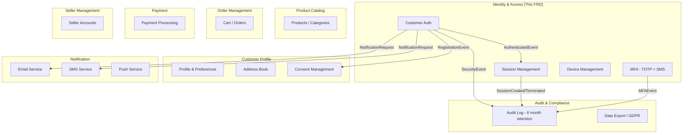
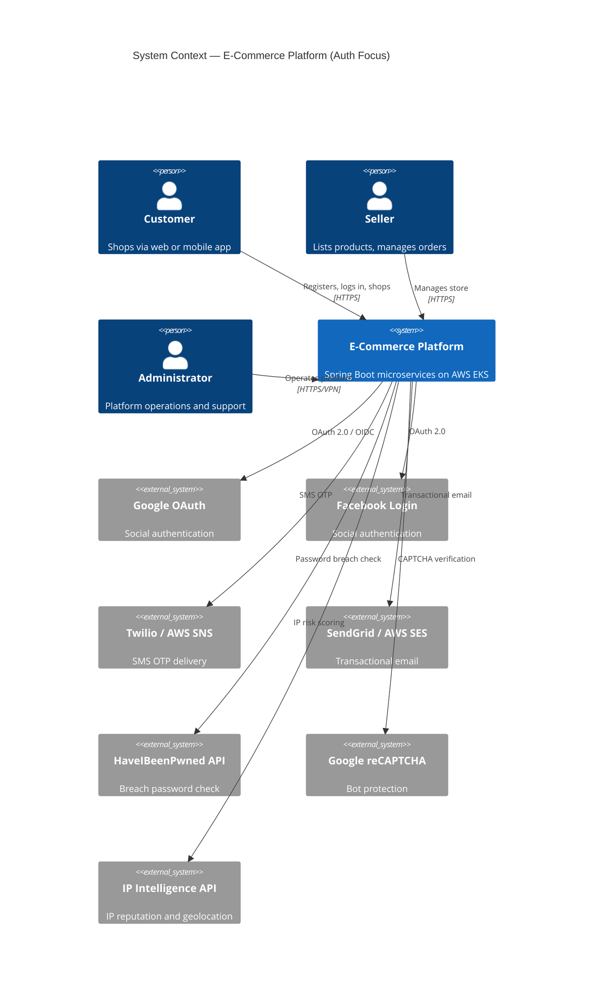
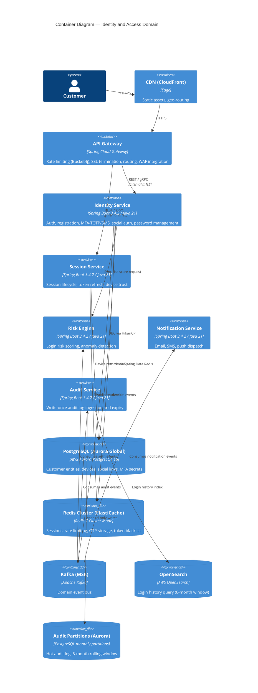
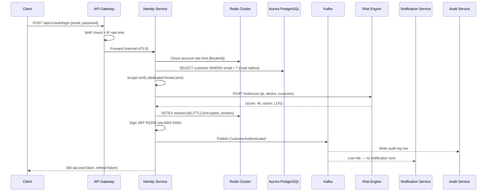
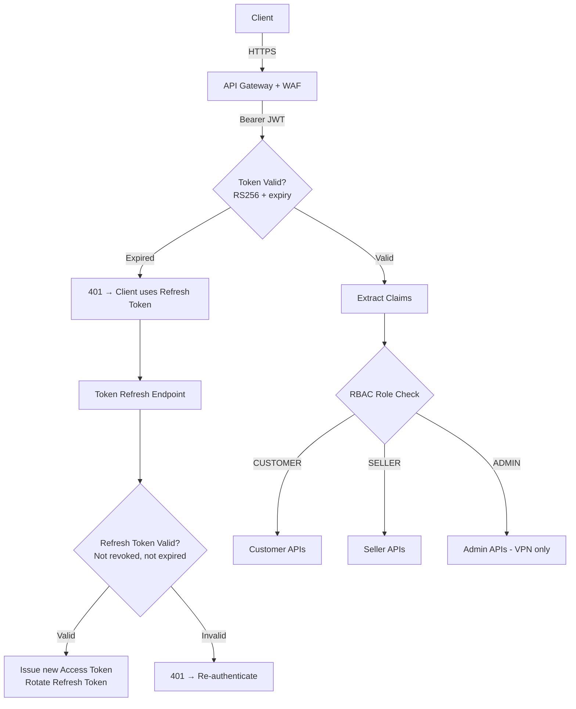
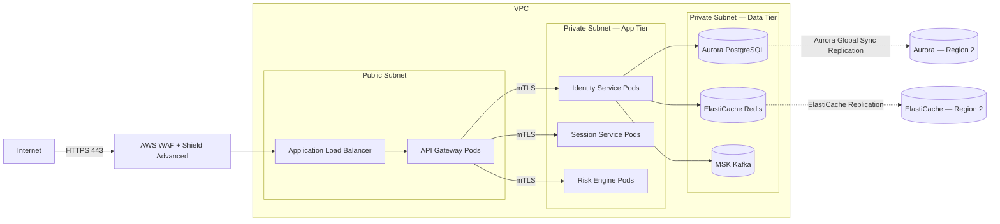
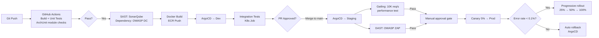

# Enterprise Architecture Design — E-Commerce Platform
## Customer Identity & Access Management (CIAM)

*Version: 1.1 | February 2026 | Status: Approved*
*Changes from v1.0: Removed Apple Sign-In, removed biometric authentication, audit log retention reduced to 6 months, tech stack finalised.*

---

## 1. Architecture Assessment

### What Is Well-Defined (from FRD v1.0)

- Functional requirements are comprehensive: 19 sections, 50+ detailed FR IDs
- NFRs (FRD Section 14) are concrete and form the binding constraints on all architectural decisions:

| NFR | Value |
|-----|-------|
| Availability SLA | 99.99% (~52 min downtime/year) |
| Concurrent logins | 10,000 req/sec |
| Registered customers | 100 million |
| Daily active users | 10 million |
| Concurrent sessions | 5 million |
| Login events/day | 50 million |
| Token validation latency | < 50ms |
| Session lookup latency | < 10ms |
| RTO | < 15 minutes |
| RPO | < 1 minute |

- Security constraints are explicit: bcrypt cost ≥ 12, RS256 / 2048-bit keys, AES-256 at rest, TLS 1.2+
- Compliance scope: GDPR, CCPA, CAN-SPAM, TCPA, CASL

### Gaps and Assumptions

| Gap in Prompt | Assumption Made |
|---|---|
| Cloud provider not specified | **AWS** |
| Geographic distribution not specified | **Multi-region active-active** (required for 99.99% + RPO < 1 min) |
| Authentication model left blank | **JWT RS256 + OAuth 2.0 / OIDC** (from NFR-SEC-003) |
| Authorization model left blank | **RBAC** (Customer / Seller / Admin roles) |
| Multi-tenancy left blank | **Single-tenant SaaS** |
| Data sensitivity left blank | **PII (High)** — names, emails, phones, behavioral data |
| Network model left blank | **Zero-trust / private VPC + public API Gateway** |
| Tech stack file was empty | **Spring Boot 3.4.2 + Java 21** (from existing project) |

### Critical Pre-Architecture Risks

1. **10K logins/sec with bcrypt cost 12**: bcrypt at cost 12 takes ~100ms per hash on commodity hardware. At 10K logins/sec, the auth service needs a dedicated CPU-intensive thread pool, or async off-thread hashing. Validate in a month-2 spike before committing pod sizing.
2. **RPO < 1 min with PostgreSQL**: standard async replication cannot meet this. Aurora Global Database is required with synchronous lag typically < 1 sec.
3. **Audit log volume**: 50M events/day × 180 days = ~9 billion rows at peak. PostgreSQL monthly partitions + OpenSearch is sufficient given the 6-month retention window.

---

## 2. Recommended Architectural Style

### Decision: Federated Microservices — Identity Service as Tier-0

**Justification:**
- Multiple squads → each squad owns a domain independently
- 99.99% auth availability requires auth isolation: a catalog outage must never affect login
- 10K logins/sec requires dedicated horizontal autoscaling of the auth service
- Identity & Access is a clean bounded context with well-defined API contracts

**Phased approach:**

| Phase | Months | Approach |
|---|---|---|
| 1 | 1–3 | Modular monolith with hard package boundaries (ArchUnit enforced) |
| 2 | 4 | Extract `identity-service` as first standalone microservice |
| 3 | 5–9 | Extract `notification-service`, `audit-service`, `risk-engine` |
| 4 | 10–12 | Remaining commerce domains (catalog, orders, payment) |

### Trade-offs vs Alternatives

| Style | Why Not Chosen |
|---|---|
| Pure Monolith | Cannot independently scale auth to 10K req/s; single point of failure |
| Full Microservices from Day 1 | Premature for greenfield; boundaries not yet validated by real usage |
| Serverless | Cold starts violate < 50ms token validation NFR |
| Event-Driven Only | Auth flows are inherently synchronous — login must return tokens immediately |

---

## 3. Domain Model

### Bounded Contexts



### Domain Events — Identity & Access

| Event | Producer | Consumers |
|---|---|---|
| `CustomerRegistered` | Identity Service | Profile Service, Notification, Audit |
| `EmailVerified` | Identity Service | Profile Service, Audit |
| `CustomerAuthenticated` | Identity Service | Audit, Risk Engine |
| `AuthenticationFailed` | Identity Service | Risk Engine, Audit |
| `AccountLocked` | Identity Service | Notification, Audit |
| `PasswordChanged` | Identity Service | Session Service, Notification, Audit |
| `MFAEnrolled` | Identity Service | Audit, Notification |
| `SuspiciousActivityDetected` | Risk Engine | Identity Service, Notification, Audit |
| `SessionTerminated` | Session Service | Audit, Push Notification |

### Shared Kernel

- `CustomerId` (UUID) — universal customer identifier across all contexts
- `AuditEvent` schema — write-once log record format shared between Identity and Audit contexts
- `DeviceInfo` struct — shared between Identity, Session, and Notification contexts

---

## 4. System Architecture Design

### 4.1 C4 Level 1 — Context Diagram



### 4.2 C4 Level 2 — Container Diagram



### 4.3 Data Architecture

| Store | Technology | Data Stored | Retention |
|---|---|---|---|
| Customer records | Aurora PostgreSQL 16 (Global DB) | Customer, Device, MFA, SocialLink, PasswordHistory | Duration of account |
| Session store | ElastiCache Redis 7 Cluster | Active sessions, refresh tokens, OTPs, token blacklist | Per session type TTL |
| Rate limit counters | ElastiCache Redis 7 | Per-IP, per-account, per-phone counters | Sliding window (minutes) |
| Audit log (hot) | Aurora PostgreSQL (monthly partitions) | All auth events | **6 months — partition drop after expiry** |
| Login history (queryable) | OpenSearch | Auth events for customer-facing history | **6 months** |
| Consent records | Aurora PostgreSQL | Terms acceptance, marketing consent | Indefinite (legal requirement) |

**Simplified storage rationale (6-month audit retention):**
At 50M events/day × 180 days, the audit dataset peaks at ~9 billion rows. Monthly PostgreSQL partitions (one partition per calendar month, dropped at 7 months) combined with an OpenSearch index covers all access patterns. S3 Glacier tiering is not required.

**Data ownership rule:** Identity Service is the sole writer to the `identity` schema. All other services consume events via Kafka or call the Identity Service API — no cross-schema direct DB reads.

### 4.4 Integration Architecture — Login Sequence



**Sync vs Async decisions:**
| Flow | Protocol | Reason |
|---|---|---|
| Login, token refresh, MFA verify | REST (sync) | Client blocks waiting for result |
| Risk score lookup | gRPC (sync) | Must influence the login response |
| Audit log write | Kafka (async) | Non-blocking; eventual consistency is acceptable |
| Notification send (email/SMS) | Kafka (async) | Delivery latency is acceptable; auth flow must not wait |
| Login history indexing | Kafka (async) | Read-side projection; eventual consistency acceptable |

---

## 5. Technology Stack

> **Comparison note:** `docs/customer-auth-tech-stack-spring-java.md` (v2.0) was reviewed alongside this document. Decisions from that comparison are reflected below and recorded in the change log of the tech stack file. Key adoptions: Spring Authorization Server, Spring Cloud Gateway, Istio, Docker. Key overrides: Spring MVC + Virtual Threads over WebFlux, AWS Secrets Manager over HashiCorp Vault, AWS AppConfig over Spring Cloud Config Server, JPA over R2DBC.

### 5.1 Backend Services

| Concern | Library / Technology | Version | Justification |
|---|---|---|---|
| Framework | Spring Boot | 3.4.2 | Existing project baseline; mature ecosystem |
| Runtime | Java + Virtual Threads (Project Loom) | 21 LTS | Handles 10K req/s with imperative code; avoids reactive complexity of WebFlux |
| Token issuer | Spring Authorization Server | 1.x | Standards-compliant OAuth2/OIDC server; issues and manages RS256 JWTs |
| JWT library | `com.nimbusds:nimbus-jose-jwt` | 9.x | Used internally by Spring Authorization Server; best RS256/JWKS support |
| Spring Security | `spring-boot-starter-security` | managed | Filter chain, method security, CSRF, headers |
| Social OAuth | `spring-boot-starter-oauth2-client` | managed | Google + Facebook OIDC/OAuth2 flows |
| TOTP (MFA) | `com.warrenstrange:googleauth` | latest | Widely adopted; Spring Security examples reference it; TOTP + backup codes |
| Password hashing | `BCryptPasswordEncoder` (Spring Security) | managed | bcrypt cost 12 (primary); `Argon2PasswordEncoder` documented for future upgrade |
| Password breach | HaveIBeenPwned k-anonymity REST API | N/A | Privacy-safe SHA-1 prefix lookup; no PII sent |
| Rate limiting | `com.github.vladimir-bukhtoyarov:bucket4j-redis` | 8.x | Redis-backed distributed token bucket; Spring Gateway filter integration |
| ORM | Spring Data JPA + Hibernate 6 | managed | Entity management; HikariCP pool works naturally with virtual threads |
| Resilience | `io.github.resilience4j:resilience4j-spring-boot3` | 2.x | Circuit breaker, retry, bulkhead for Risk Engine and external OAuth calls |
| Validation | `spring-boot-starter-validation` | managed | Jakarta Bean Validation 3 on all request DTOs |
| Migrations | Flyway | 10.x | Expand-contract safe schema migrations; auto-run on startup |
| Observability facade | Micrometer + Spring Boot Actuator | managed | Auto-instrumented Spring MVC, HikariCP, Redis, Kafka metrics; K8s liveness/readiness probes |
| API documentation | SpringDoc OpenAPI | 2.x | Auto-generated OpenAPI 3 specs from annotations |
| DTO mapping | MapStruct | 1.6.x | Compile-time type-safe entity ↔ DTO mapping |

**Removed from scope:**
- ~~`com.yubico:webauthn-server-core`~~ — biometric authentication removed
- ~~Apple Sign-In OIDC provider~~ — Apple authentication removed
- ~~Spring Data R2DBC~~ — not needed; virtual threads eliminate the need for reactive DB access

### 5.2 Data Layer

| Component | Technology | Version | Justification |
|---|---|---|---|
| Primary database | Amazon Aurora PostgreSQL (Global Database) | PostgreSQL 16 compat | Sub-second cross-region replication; meets RPO < 1 min; managed failover |
| Session / cache | Amazon ElastiCache Redis (Cluster Mode) | Redis 7 | < 10ms session lookup; TTL-managed expiry; pub/sub for invalidation; Bucket4j rate limiting |
| Event bus | Amazon MSK (Managed Kafka) | Kafka 3.x | Durable ordered event log; replay capability; scales to 50M events/day |
| Login history | Amazon OpenSearch Service | OpenSearch 2.x | Full-text + date-range queries on 6-month event window |
| Backup / archival | Amazon S3 Standard | N/A | Aurora automated backups; no Glacier required with 6-month retention |

**Removed from earlier draft:**
- ~~Amazon S3 Glacier~~ — not required with 6-month audit retention

### 5.3 Infrastructure & DevOps

| Concern | Technology | Justification |
|---|---|---|
| Container build | Docker | Standard Dockerfile; portable; works with all CI/CD systems |
| Container runtime | Docker | Standard; EKS compatible |
| Orchestration | Amazon EKS (Kubernetes 1.31) | Managed control plane; HPA for autoscaling; Karpenter for node scaling |
| API Gateway | Spring Cloud Gateway | Native Spring Security integration; reactive routing; Bucket4j filter for rate limiting; no external service |
| IaC | Terraform (module-per-service) | Reproducible; multi-environment |
| CI/CD | GitHub Actions (build + test) + ArgoCD (GitOps deploy) | Separation of CI and CD; GitOps audit trail |
| Container registry | Amazon ECR | Native EKS integration |
| Service mesh | Istio | mTLS between services; richer traffic management and observability than AWS App Mesh |
| Secrets | AWS Secrets Manager + AWS KMS | Auto-rotation; CMK for JWT signing; envelope encryption for TOTP secrets |
| Config | AWS AppConfig | Per-environment config; feature flags (risk thresholds, MFA enforcement); serverless — no Config Server to operate |
| Certificates | AWS Certificate Manager | Automated rotation for public TLS |

### 5.4 Observability

| Concern | Technology |
|---|---|
| Metrics | Prometheus + Grafana |
| Distributed tracing | OpenTelemetry SDK → AWS X-Ray |
| Structured logging | Logback JSON → Fluent Bit → Amazon CloudWatch / OpenSearch |
| Alerting | Grafana Alerts + PagerDuty |
| Uptime / synthetic monitoring | CloudWatch Synthetics (login flow, token refresh) |
| SLO tracking | Grafana SLO dashboards (99.99% auth availability) |

### 5.5 External Integrations

| Provider | Purpose | Fallback |
|---|---|---|
| Google OAuth 2.0 / OIDC | Social login | N/A (provider-specific; unavailability surfaced to user) |
| Facebook OAuth 2.0 | Social login | N/A |
| Twilio | SMS OTP delivery | AWS SNS (secondary SMS provider) |
| SendGrid | Transactional email | AWS SES (secondary) |
| HaveIBeenPwned API | Password breach check at registration | Fail open (log warning; do not block registration) |
| Google reCAPTCHA v3 / v2 | Bot protection on login + reset | Fail open with enhanced logging |
| IP Intelligence (e.g., MaxMind GeoIP2) | Geolocation + IP reputation for risk scoring | Local GeoIP2 database fallback |

---

## 6. Security Architecture

### 6.1 AuthN / AuthZ Flow



**JWT Access Token Claims:**
```json
{
  "iss": "https://auth.ecommerce.com",
  "sub": "customer-uuid",
  "aud": ["ecommerce-api"],
  "exp": 1740000900,
  "iat": 1740000000,
  "jti": "unique-token-id",
  "roles": ["CUSTOMER"],
  "deviceId": "device-uuid",
  "sessionId": "session-uuid",
  "authMethod": "PASSWORD",
  "mfaVerified": true
}
```

**Token lifetimes:**

| Session Type | Access Token TTL | Refresh Token TTL | Idle Timeout |
|---|---|---|---|
| Standard | 15 minutes | 7 days | 30 minutes |
| Remember Me | 15 minutes | 30 days | 24 hours |
| High Security | 5 minutes | 1 hour | 10 minutes |

**RS256 Key Management:**
- RSA 2048-bit key pair managed in AWS KMS (Customer Managed Key)
- Private key never leaves KMS — signing via `kms:Sign` API
- Public keys served at `/.well-known/jwks.json` — cached at API Gateway (5-min TTL)
- Key rotation: every 90 days; 24-hour overlap window where both old and new keys are accepted

### 6.2 Secrets Management

| Secret | Storage | Rotation |
|---|---|---|
| JWT signing key | AWS KMS (CMK) | Every 90 days (automated) |
| Database credentials | AWS Secrets Manager | Every 30 days (automated) |
| Redis auth token | AWS Secrets Manager | Every 30 days |
| Social OAuth client secrets (Google, Facebook) | AWS Secrets Manager | Manual (per provider policy) |
| SMS / email API keys | AWS Secrets Manager | Every 90 days |
| MFA TOTP secrets | PostgreSQL (AES-256 via KMS envelope encryption) | On MFA reset |
| Backup codes | PostgreSQL (bcrypt hashed) | On code regeneration |

### 6.3 Network Segmentation



- All inter-service traffic: mTLS (Istio sidecar — Envoy proxy)
- Database port accessible only from App Tier security group
- Admin APIs accessible only from corporate VPN CIDR
- WAF rules: OWASP Core Rule Set + custom rate-limit rules + geo-blocking

### 6.4 STRIDE Threat Model — Top Threats

| Threat | Category | Mitigation |
|---|---|---|
| Credential stuffing with leaked passwords | Spoofing | Multi-layer rate limiting (Bucket4j/Redis); reCAPTCHA v3; HaveIBeenPwned check at registration |
| JWT forgery | Tampering | RS256 asymmetric; private key in KMS; JWKS endpoint for validation |
| Session hijacking via XSS | Elevation of Privilege | HttpOnly Secure cookies for refresh tokens; CSP headers; short-lived access tokens (15 min) |
| Email enumeration via registration / login | Information Disclosure | Constant-time responses; generic error messages (no differential timing) |
| TOTP replay attack | Repudiation | TOTP time window used-code cache in Redis (invalidate after first use in window) |
| Refresh token replay | Repudiation | Refresh token rotation; full session family revocation on replay detection |
| SQL injection | Tampering | Parameterized queries via JPA; no raw SQL; input validation via Bean Validation |
| Account takeover via password reset | Elevation of Privilege | UUID reset token (1-hour TTL); single-use; consistent response timing |
| Social account hijack via email conflict | Spoofing | Social account linking requires current session + confirmed email match; no silent merge |
| Rate limiting bypass via IP rotation | Spoofing | Account-level rate limit layer independent of IP layer; risk score per device fingerprint |

### 6.5 Encryption Strategy

| Data | In Transit | At Rest |
|---|---|---|
| All API traffic | TLS 1.3 (minimum 1.2) | N/A |
| DB connections | TLS (Aurora enforced SSL) | AES-256 (Aurora storage encryption, AWS KMS) |
| PII fields (email, phone) | TLS | Application-level AES-256-GCM (KMS-managed DEK) |
| TOTP MFA secrets | TLS | AES-256 envelope encryption (KMS) |
| Redis session data | TLS (ElastiCache in-transit) | AES-256 (ElastiCache at-rest encryption) |
| Kafka messages containing PII | TLS + MSK broker encryption | Kafka at-rest encryption |
| Audit logs in Aurora | TLS | Aurora AES-256 at rest |

---

## 7. Scalability and Resilience

### 7.1 Scaling Strategy

| Component | Strategy | Trigger |
|---|---|---|
| Identity Service | Horizontal pod autoscaling | CPU > 60% or > 2K RPS per pod |
| Session Service | Horizontal pod autoscaling | Memory > 70% or > 5K RPS per pod |
| Risk Engine | Horizontal pod autoscaling | CPU > 70% |
| Aurora PostgreSQL | Read replicas (3) + writer for mutations | Aurora Auto Scaling on replica lag |
| Redis Cluster | 16 shards, 3 nodes each | ElastiCache Auto Scaling on memory |
| Kafka | Partition scaling per topic | MSK managed scaling |

**Target pod count for 10K logins/sec:**
- Identity Service: 20 pods × 500 RPS/pod (Java 21 virtual threads, 4 vCPU / 8GB RAM each)
- Bcrypt hashing: separate VirtualThreadExecutor pool (CPU-bound, isolated from I/O threads)

### 7.2 Caching Strategy

```
L1 — JVM In-Process (Caffeine, per pod)
├── JWKS public keys                    5-min TTL
├── Disposable email domain blocklist   1-hour TTL
└── Common password list                Process lifetime

L2 — Redis Cluster (shared, distributed)
├── Active sessions                     Per session-type TTL
├── Rate limit counters                 Sliding window
├── OTP codes                           5-min TTL
├── Token blacklist (revoked JTIs)      Access token TTL
└── Email uniqueness lock               60-sec mutex during registration

L3 — Aurora Read Replicas
├── Customer record lookups during auth
└── Device fingerprint lookups
```

### 7.3 Resilience Patterns

| Pattern | Applied To | Implementation |
|---|---|---|
| Circuit Breaker | Risk Engine, external OAuth (Google, Facebook), SMS/email | Resilience4j — open after 5 failures in 10s |
| Retry with Exponential Backoff | Kafka producer, external API calls | Resilience4j Retry + Spring Kafka |
| Bulkhead | Social auth (isolated thread pool per provider) | Resilience4j Bulkhead (max concurrent calls per provider) |
| Graceful Degradation | Risk Engine unavailable → default MEDIUM risk (require MFA) | Resilience4j fallback |
| Graceful Degradation | Redis unavailable → stateless JWT-only mode (no new sessions) | Custom fallback in SessionService |
| Read-your-writes consistency | Customer login immediately after registration | Route writes + immediate reads to Aurora primary writer |
| Token Bucket Rate Limiting | All auth endpoints | Bucket4j + Redis atomic operations |

### 7.4 Database Scaling

- **Aurora Global Database**: Primary writer in `us-east-1`; read replica cluster in `eu-west-1` (< 1 sec replication lag → meets RPO < 1 min in most scenarios)
- **Read / write separation**: Login lookups → read replicas; writes (registration, session, audit) → primary writer
- **Connection pooling**: HikariCP (max 20 per pod) + PgBouncer sidecar for connection multiplexing under burst load
- **Audit log partitioning**: Monthly range partitions on `audit_log.event_time`; partition maintenance job runs on the 1st of each month, dropping the 7-month-old partition (enforcing 6-month retention)
- **Key indexes**: unique index on `customer.email` (lowercase b-tree); composite index `(customer_id, created_at)` on `login_history`; hash index on `session.session_id` lookups

---

## 8. DevOps and Deployment

### 8.1 Environment Strategy

| Environment | Purpose | Data |
|---|---|---|
| `dev` | Feature development | Anonymised subset (Faker-generated) |
| `staging` | Integration tests, load tests (Gatling) | Full anonymised copy, refreshed weekly |
| `prod-us` | US production | Live |
| `prod-eu` | EU production (GDPR data residency) | Live — separate Aurora cluster, Frankfurt region |

### 8.2 CI/CD Pipeline



### 8.3 Infrastructure as Code Structure

```
terraform/
├── modules/
│   ├── eks-cluster/          # Node groups, HPA, autoscaling groups
│   ├── aurora-global/        # Aurora PostgreSQL multi-region
│   ├── elasticache-redis/    # Redis cluster mode, 16 shards
│   ├── msk-kafka/            # MSK cluster + topic definitions
│   ├── api-gateway/          # Kong or AWS APIGW routing + rate limits
│   └── waf/                  # OWASP CRS rules, Shield Advanced
├── environments/
│   ├── dev/
│   ├── staging/
│   ├── prod-us/
│   └── prod-eu/
└── global/
    └── iam-roles/            # Least-privilege service IAM roles
```

### 8.4 Deployment Strategy

- **Auth service**: Canary (5% → 25% → 100%) with automatic rollback if p99 latency or error rate spikes
- **Database schema changes**: Expand-contract pattern via Flyway; migrations are always backward-compatible (never rename/drop a column without a multi-release cycle)
- **Feature flags**: AWS AppConfig controls risk score thresholds, MFA enforcement rules, social provider toggles — runtime changes without redeployment

---

## 9. Implementation Roadmap

### Phase 1 — Foundation (Months 1–3) | Squad: Platform + Identity

| Weeks | Deliverable |
|---|---|
| 1–2 | AWS infrastructure via Terraform (EKS, Aurora, ElastiCache, MSK) |
| 3–4 | Identity Service: Customer entity, email registration (FR-REG-001, FR-REG-002, FR-REG-003) |
| 5–6 | Email/password auth (FR-AUTH-001), password policy (FR-PWD-001), bcrypt + JWT RS256 |
| 7–8 | Session management (FR-SESS-001 to FR-SESS-004), Redis session store |
| 9–10 | Rate limiting (FR-AUTH-002), account lockout (FR-SEC-001) |
| 11–12 | Audit logging (FR-AUD-001) — Kafka → Audit Service → Aurora monthly partitions; Notification Service skeleton |

**Required spike (week 2):** Validate bcrypt cost-12 throughput target. At 500 RPS per pod, 20 pods → 10K/sec. Measure actual bcrypt latency per pod and right-size thread pool before locking in pod spec.

### Phase 2 — Extended Authentication (Months 4–6) | Squad: Identity + Platform

| Weeks | Deliverable |
|---|---|
| 13–15 | Phone OTP registration + auth (FR-REG-004, FR-REG-005, FR-AUTH-003) |
| 16–17 | TOTP MFA enrollment + verification (FR-MFA-001, FR-MFA-002, FR-MFA-003) |
| 18–19 | SMS MFA as fallback; backup codes |
| 20–22 | Social auth: Google OAuth / OIDC (FR-SOCIAL-001) + Facebook (FR-SOCIAL-002) |
| 23–24 | Social account linking (FR-SOCIAL-004); password reset flows (FR-PWD-002, FR-PWD-003) |

### Phase 3 — Security and Compliance (Months 7–9) | Squad: Security + Identity

| Weeks | Deliverable |
|---|---|
| 25–27 | Risk Engine: risk scoring model (FR-SEC-002), suspicious activity detection, IP intelligence integration |
| 28–30 | Device management (FR-DEV-001, FR-DEV-002), device trust management, multi-device session management (FR-SESS-005) |
| 31–33 | Account recovery (FR-REC-001, FR-REC-002); GDPR compliance: data export, account deletion, consent audit (FR-AUD-002) |
| 34–36 | Login history UI (FR-SEC-003); security notifications; load test to verified 10K logins/sec; 6-month audit partition lifecycle validation |

### Phase 4 — Commerce Platform (Months 10–12) | All Squads

| Deliverable |
|---|
| Product Catalog Service |
| Order Management + Cart Service |
| Payment Service (Stripe integration) |
| Seller Management Service |
| API Gateway hardening; full observability dashboards |
| Multi-region failover drill to validate RTO < 15 min + RPO < 1 min |

### Team Structure (Conway's Law)

| Squad | Services Owned | Size |
|---|---|---|
| Identity Squad | Identity Service, Session Service | 4–5 engineers + TL |
| Risk & Security Squad | Risk Engine, Audit Service | 3–4 engineers |
| Notification Squad | Notification Service (email, SMS, push) | 2–3 engineers |
| Platform Squad | API Gateway, EKS, Terraform, CI/CD | 3–4 engineers + SRE |
| Catalog Squad | Product Catalog, Search | 4–5 engineers |
| Commerce Squad | Orders, Cart, Payment | 5–6 engineers |
| Seller Squad | Seller Management | 3–4 engineers |

---

## 10. Architecture Decision Records (ADRs)

### ADR-001: JWT RS256 over HS256 or Opaque Tokens

- **Context:** Access tokens must be validated by multiple downstream services without sharing a secret; token validation must be < 50ms
- **Decision:** RS256 (asymmetric) — Identity Service signs with private key (in KMS); downstream services validate using public key from JWKS endpoint; no Redis call required per request
- **Alternatives:** HS256 (symmetric shared secret requires all services to hold the secret); opaque tokens (every request hits Redis — adds latency, creates central dependency)
- **Trade-offs:** RS256 enables fully stateless, sub-millisecond validation at API Gateway level. Cost: key rotation requires overlap window management
- **Consequence:** JWKS endpoint must be highly available and cached; all services must refresh JWKS cache on key rotation signals

### ADR-002: Aurora Global Database over Standard PostgreSQL for Multi-Region

- **Context:** RPO < 1 minute and RTO < 15 minutes at 99.99% availability cannot be met with standard async PostgreSQL streaming replication (typical lag: 1–10 sec, manual failover)
- **Decision:** Amazon Aurora PostgreSQL with Global Database — synchronous cross-region replication, < 1 sec lag, managed automated failover
- **Alternatives:** Standard PostgreSQL with streaming replication; CockroachDB (distributed SQL, no regional lag); PlanetScale (MySQL-based)
- **Trade-offs:** AWS vendor lock-in; ~3× cost vs standard RDS; cannot easily migrate off Aurora
- **Consequence:** RPO is met in normal operation; in extreme network partition scenarios, lag may briefly exceed 1 sec — document as an accepted edge-case exception

### ADR-003: Redis for Session Storage over Database-backed or Pure JWT Stateless Sessions

- **Context:** Session lookup must be < 10ms; 5M concurrent sessions; sessions must be individually revocable (logout all, password-change revocation)
- **Decision:** ElastiCache Redis Cluster Mode — encrypted, multi-AZ, TTL-managed, O(1) lookup
- **Alternatives:** Database-backed sessions (Aurora, too slow for 10ms target); pure stateless JWT (cannot revoke individual sessions without a blacklist, which is Redis anyway)
- **Trade-offs:** Redis is an additional infrastructure dependency; Redis failure without fallback causes auth outage
- **Consequence:** Defined graceful degradation: on Redis failure, new session creation is disabled; existing valid short-lived access tokens (15 min) continue to work via stateless RS256 validation

### ADR-004: Kafka (MSK) for Domain Events over Direct Service Calls

- **Context:** Auth events trigger notifications, audit writes, risk model updates — these must not block the login response path
- **Decision:** Kafka as the async event bus for all post-authentication side effects
- **Alternatives:** RabbitMQ (no replay, weaker ordering); AWS SNS/SQS (simpler but no compaction/replay); direct async REST calls (fragile under downstream failures)
- **Trade-offs:** Kafka adds operational complexity and requires partition/consumer-group management; in exchange: durable, ordered, replayable event log; audit log can be reconstructed from Kafka if needed
- **Consequence:** Notifications and audit writes are eventually consistent (typically < 1 sec); auth latency is decoupled from notification send

### ADR-005: Social Authentication Scope — Google + Facebook Only

- **Context:** Apple Sign-In has been removed from scope. The two remaining providers (Google, Facebook) cover the majority of social login use cases and are supported natively by `spring-boot-starter-oauth2-client`
- **Decision:** Implement Google OIDC and Facebook OAuth 2.0 only; abstract behind a `SocialAuthProvider` interface to allow future provider additions without core service changes
- **Alternatives:** Include Apple (private relay email complexity, native SDK required, App Store mandate applies only to iOS apps)
- **Trade-offs:** iOS App Store requires Apple Sign-In if any social login is offered in a native app. If a native iOS app is launched in the future, Apple Sign-In must be added
- **Consequence:** If iOS native app is planned, Apple Sign-In must be revisited — the `SocialAuthProvider` interface makes this an additive change

---

## 11. Risk Register

| ID | Risk | Likelihood | Impact | Mitigation |
|---|---|---|---|---|
| R-001 | **bcrypt cost-12 throughput bottleneck at 10K logins/sec** — ~100ms per hash; single thread does ~10/sec | Medium | High | Dedicated VirtualThread executor pool for bcrypt; validate RPS in week-2 spike; right-size pod count before phase 1 completion |
| R-002 | **Aurora Global DB RPO < 1 min not met under extreme network partition** | Low | Critical | Validate in DR drill (month 11); document accepted exception; alert within 30 sec of replication lag spike |
| R-003 | **Redis failure causes full auth outage** | Low | Critical | Redis Cluster Mode (16 shards, no SPOF); ElastiCache Multi-AZ; graceful degradation to stateless JWT-only for in-flight access tokens; circuit breaker alerts ops immediately |
| R-004 | **SMS OTP deliverability failures in certain regions** | Medium | Medium | Dual SMS provider (Twilio primary, AWS SNS secondary); TOTP app as preferred MFA channel; voice OTP as fallback |
| R-005 | **GDPR right-to-erasure conflicts with consent record indefinite retention** | Medium | Medium | Anonymise PII in consent records on account deletion; retain only hashed customer reference + timestamp + terms version |
| R-006 | **Social provider API change breaks OAuth flow (Google or Facebook)** | Medium | Medium | `SocialAuthProvider` adapter interface isolates provider logic; circuit breaker per provider; social login failure degrades gracefully to email/password |
| R-007 | **iOS App Store rejects app for missing Apple Sign-In** | High | Medium | Known gap (ADR-005); Apple Sign-In is additive via the provider abstraction; add as phase-3 item if native iOS app is confirmed in product roadmap |
| R-008 | **Audit partition growth exceeds Aurora storage budget** | Low | Low | 6-month retention = max ~9B rows; monthly partition drop job automated via `@Scheduled`; Aurora auto-storage scaling as safety net; OpenSearch index lifecycle policy at 180 days |
