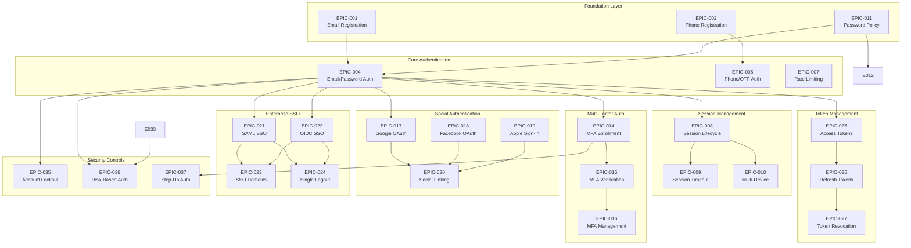

# Customer Authentication System — Epics Overview & Roadmap

> Based on 53 activity diagrams, the following epics have been identified and organized by functional area. Each epic contains user stories derived from the detailed activity flows.

---

## Epic Summary Table

| Epic ID | Epic Name | Priority | Size | Dependencies |
|---------|-----------|----------|------|--------------|
| EPIC-001 | Email Registration & Verification | P0 - Critical | XL | None |
| EPIC-002 | Phone Registration & OTP | P0 - Critical | L | EPIC-001 |
| EPIC-003 | Profile Completion & Management | P1 - High | L | EPIC-001, EPIC-002 |
| EPIC-004 | Email/Password Authentication | P0 - Critical | XL | EPIC-001 |
| EPIC-005 | Phone/OTP Authentication | P0 - Critical | L | EPIC-002, EPIC-004 |
| EPIC-006 | Biometric Authentication | P1 - High | M | EPIC-004 |
| EPIC-007 | Rate Limiting & Throttling | P0 - Critical | M | EPIC-004 |
| EPIC-008 | Session Lifecycle Management | P0 - Critical | XL | EPIC-004 |
| EPIC-009 | Session Timeout & Renewal | P0 - Critical | M | EPIC-008 |
| EPIC-010 | Multi-Device Session Management | P1 - High | M | EPIC-008 |
| EPIC-011 | Password Policy & Validation | P0 - Critical | M | None |
| EPIC-012 | Password Reset | P0 - Critical | L | EPIC-001, EPIC-011 |
| EPIC-013 | Password Change | P1 - High | M | EPIC-004, EPIC-011 |
| EPIC-014 | MFA Enrollment | P0 - Critical | L | EPIC-004 |
| EPIC-015 | MFA Verification | P0 - Critical | L | EPIC-014 |
| EPIC-016 | MFA Management | P1 - High | M | EPIC-014, EPIC-015 |
| EPIC-017 | Google OAuth Integration | P0 - Critical | L | EPIC-004 |
| EPIC-018 | Facebook OAuth Integration | P1 - High | M | EPIC-004 |
| EPIC-019 | Apple Sign-In Integration | P1 - High | M | EPIC-004 |
| EPIC-020 | Social Account Linking | P2 - Medium | M | EPIC-017, EPIC-018, EPIC-019 |
| EPIC-021 | SAML SSO Integration | P1 - High | XL | EPIC-004 |
| EPIC-022 | OIDC SSO Integration | P1 - High | L | EPIC-004 |
| EPIC-023 | SSO Domain Management | P1 - High | M | EPIC-021, EPIC-022 |
| EPIC-024 | Single Logout (SLO) | P2 - Medium | M | EPIC-021, EPIC-022 |
| EPIC-025 | Access Token Management | P0 - Critical | L | EPIC-004 |
| EPIC-026 | Refresh Token Management | P0 - Critical | L | EPIC-025 |
| EPIC-027 | Token Revocation | P0 - Critical | M | EPIC-025, EPIC-026 |
| EPIC-028 | Token Introspection | P2 - Medium | S | EPIC-025 |
| EPIC-029 | Profile Information Management | P1 - High | M | EPIC-003 |
| EPIC-030 | Contact Information Management | P1 - High | M | EPIC-029 |
| EPIC-031 | Address Book Management | P1 - High | M | EPIC-029 |
| EPIC-032 | Communication Preferences | P2 - Medium | M | EPIC-029 |
| EPIC-033 | Device Registration & Fingerprinting | P1 - High | M | EPIC-004 |
| EPIC-034 | Device Trust Management | P1 - High | M | EPIC-033, EPIC-014 |
| EPIC-035 | Account Lockout Mechanism | P0 - Critical | M | EPIC-004 |
| EPIC-036 | Risk-Based Authentication | P1 - High | XL | EPIC-004, EPIC-033 |
| EPIC-037 | Step-Up Authentication | P1 - High | L | EPIC-004, EPIC-014 |
| EPIC-038 | Login History & Audit | P1 - High | M | EPIC-004 |
| EPIC-039 | Account Deactivation | P1 - High | M | EPIC-004 |
| EPIC-040 | Account Reactivation | P1 - High | S | EPIC-039 |
| EPIC-041 | Account Deletion (GDPR) | P0 - Critical | L | EPIC-039 |
| EPIC-042 | Security Alert Notifications | P0 - Critical | L | EPIC-004 |
| EPIC-043 | Account Change Notifications | P1 - High | M | EPIC-042 |
| EPIC-044 | Notification Preference Management | P2 - Medium | M | EPIC-042 |
| EPIC-045 | Authentication Audit Logging | P0 - Critical | L | EPIC-004 |
| EPIC-046 | GDPR Data Export | P1 - High | M | EPIC-045 |
| EPIC-047 | Consent Management | P1 - High | M | EPIC-001 |
| EPIC-048 | Account Recovery | P0 - Critical | L | EPIC-012, EPIC-014 |
| EPIC-049 | MFA Recovery | P1 - High | M | EPIC-014, EPIC-048 |
| EPIC-050 | External IdP Integration | P1 - High | L | EPIC-021, EPIC-022 |
| EPIC-051 | Webhook Event Delivery | P2 - Medium | M | EPIC-045 |
| EPIC-052 | Authentication Error Handling | P0 - Critical | M | EPIC-004 |
| EPIC-053 | Service Resilience & Failover | P1 - High | L | All |

---

## Detailed Epic Specifications

---

### EPIC-001: Email Registration & Verification

| Attribute | Value |
|-----------|-------|
| **Priority** | P0 - Critical |
| **Business Value** | Foundation for customer acquisition |
| **Estimated Size** | XL (40–60 story points) |
| **Target Release** | MVP |
| **Dependencies** | None |
| **Source Diagrams** | 1.1 Email Registration, 1.2 Email Verification |

**Description:** Enable new customers to create accounts using their email address and password, with a secure email verification process to confirm ownership of the email address.

**Business Goals:**
- Acquire new customers through a frictionless registration process
- Ensure email ownership verification for account security
- Comply with anti-spam and email verification requirements
- Prevent fraudulent account creation

**Acceptance Criteria:**
- Users can register with email, password, and basic profile information
- Password strength is validated in real-time against security policy
- Disposable email domains are blocked
- Duplicate email addresses are detected with secure messaging
- Verification email is sent within 30 seconds
- Verification token expires after 24 hours
- Users can resend verification email (rate limited)
- Account is activated upon successful verification
- Registration events are logged for audit

**User Stories:**

| Story ID | Story Title | Priority | Points |
|----------|-------------|----------|--------|
| US-001-01 | Display registration form with required fields | P0 | 3 |
| US-001-02 | Validate email format (RFC 5322) | P0 | 2 |
| US-001-03 | Block disposable email domains | P0 | 3 |
| US-001-04 | Check email uniqueness without enumeration | P0 | 3 |
| US-001-05 | Validate password against policy | P0 | 5 |
| US-001-06 | Check password against breached database (HIBP) | P1 | 5 |
| US-001-07 | Display real-time password strength indicator | P1 | 3 |
| US-001-08 | Validate name fields (letters, spaces, hyphens) | P0 | 2 |
| US-001-09 | Require terms and conditions acceptance | P0 | 2 |
| US-001-10 | Capture optional marketing consent | P0 | 2 |
| US-001-11 | Apply and validate referral codes | P2 | 3 |
| US-001-12 | Hash password with bcrypt (cost factor 12) | P0 | 2 |
| US-001-13 | Generate secure verification token (UUID) | P0 | 2 |
| US-001-14 | Store customer with PENDING_VERIFICATION status | P0 | 3 |
| US-001-15 | Send verification email with personalized content | P0 | 5 |
| US-001-16 | Validate verification token on click | P0 | 3 |
| US-001-17 | Handle expired verification tokens | P0 | 2 |
| US-001-18 | Handle already-verified accounts | P0 | 2 |
| US-001-19 | Update account status to ACTIVE on verification | P0 | 2 |
| US-001-20 | Implement resend verification with rate limiting | P0 | 3 |
| US-001-21 | Publish EmailVerified event | P1 | 2 |
| US-001-22 | Log registration and verification in audit trail | P0 | 3 |

**Technical Notes:**
- Use Redis for rate limiting and token storage
- Implement consistent response times to prevent enumeration attacks
- Store registration metadata (IP, user agent, timestamp)
- Email service integration required (SendGrid/SES)

**Risks & Mitigations:**

| Risk | Impact | Mitigation |
|------|--------|------------|
| Email delivery delays | User frustration | Queue with retry, show estimated time |
| Disposable domain list outdated | Fraudulent registrations | Regular updates, multiple sources |
| HIBP API unavailable | Registration blocked | Graceful degradation, async check |

---

### EPIC-002: Phone Registration & OTP

| Attribute | Value |
|-----------|-------|
| **Priority** | P0 - Critical |
| **Business Value** | Alternative registration for mobile-first users |
| **Estimated Size** | L (25–35 story points) |
| **Target Release** | MVP |
| **Dependencies** | EPIC-001 |
| **Source Diagrams** | 1.3 Phone Registration |

**Description:** Enable customers to register using their mobile phone number with OTP verification, providing an alternative registration path for users who prefer mobile-first experiences.

**Business Goals:**
- Support mobile-first user acquisition
- Reduce registration friction for mobile users
- Verify phone ownership for enhanced security
- Enable SMS-based authentication

**Acceptance Criteria:**
- Users can register with phone number and country code
- Phone format validation using libphonenumber
- Mobile number detection (block landlines where possible)
- OTP sent via SMS within 30 seconds
- OTP valid for 5 minutes
- Maximum 3 verification attempts before lockout
- Voice call fallback for accessibility
- Rate limiting on OTP requests (3/hour/phone)

**User Stories:**

| Story ID | Story Title | Priority | Points |
|----------|-------------|----------|--------|
| US-002-01 | Display phone registration form with country selector | P0 | 3 |
| US-002-02 | Validate phone format using libphonenumber | P0 | 3 |
| US-002-03 | Detect mobile vs landline numbers | P1 | 3 |
| US-002-04 | Check phone number uniqueness | P0 | 2 |
| US-002-05 | Generate cryptographically secure 6-digit OTP | P0 | 2 |
| US-002-06 | Store OTP hash with 5-minute TTL | P0 | 2 |
| US-002-07 | Send OTP via SMS gateway | P0 | 5 |
| US-002-08 | Display OTP entry screen with countdown timer | P0 | 3 |
| US-002-09 | Auto-submit on complete OTP entry | P1 | 2 |
| US-002-10 | Verify OTP against stored hash | P0 | 2 |
| US-002-11 | Track verification attempts (max 3) | P0 | 2 |
| US-002-12 | Lock phone for 30 minutes after failed attempts | P0 | 3 |
| US-002-13 | Implement voice call fallback for OTP | P1 | 5 |
| US-002-14 | Implement OTP resend with rate limiting | P0 | 3 |
| US-002-15 | Create account with ACTIVE status on verification | P0 | 3 |
| US-002-16 | Generate authentication tokens post-registration | P0 | 3 |

**Technical Notes:**
- SMS gateway integration required (Twilio/SNS)
- Voice call service for fallback
- Rate limiting per phone and per IP
- Consider DND (Do Not Disturb) bypass where legally permitted

---

### EPIC-003: Profile Completion & Management

| Attribute | Value |
|-----------|-------|
| **Priority** | P1 - High |
| **Business Value** | Enhanced customer data for personalization |
| **Estimated Size** | L (25–35 story points) |
| **Target Release** | MVP |
| **Dependencies** | EPIC-001, EPIC-002 |
| **Source Diagrams** | 1.4 Profile Completion Wizard |

**Description:** Guide newly registered customers through a profile completion wizard to collect additional information for personalization and enhanced user experience.

**Business Goals:**
- Collect customer preferences for personalization
- Improve delivery accuracy with saved addresses
- Enable targeted marketing based on interests
- Increase customer engagement through gamification

**Acceptance Criteria:**
- Multi-step wizard displayed after registration
- Steps can be skipped
- Progress saved between sessions
- Profile completion percentage calculated
- Optional incentive for completion
- Profile picture upload with processing
- Address validation and geocoding

**User Stories:**

| Story ID | Story Title | Priority | Points |
|----------|-------------|----------|--------|
| US-003-01 | Display profile completion wizard after registration | P0 | 3 |
| US-003-02 | Implement Step 1: Personal Information | P0 | 5 |
| US-003-03 | Implement Step 2: Contact Preferences | P0 | 5 |
| US-003-04 | Implement Step 3: Delivery Address (optional) | P1 | 5 |
| US-003-05 | Implement Step 4: Interests (optional) | P2 | 3 |
| US-003-06 | Allow skipping optional steps | P0 | 2 |
| US-003-07 | Save progress between sessions | P0 | 3 |
| US-003-08 | Calculate and display completion percentage | P1 | 3 |
| US-003-09 | Process profile picture uploads | P1 | 5 |
| US-003-10 | Validate address with external service | P2 | 5 |
| US-003-11 | Geocode addresses for coordinates | P2 | 3 |
| US-003-12 | Award completion incentive | P2 | 3 |

---

### EPIC-004: Email/Password Authentication

| Attribute | Value |
|-----------|-------|
| **Priority** | P0 - Critical |
| **Business Value** | Core authentication mechanism |
| **Estimated Size** | XL (40–60 story points) |
| **Target Release** | MVP |
| **Dependencies** | EPIC-001 |
| **Source Diagrams** | 2.1 Email/Password Login |

**Description:** Implement secure email and password authentication with comprehensive security controls including failure tracking, account lockout, CAPTCHA integration, and MFA redirection.

**Business Goals:**
- Provide secure primary authentication method
- Prevent unauthorized access through brute force protection
- Enable seamless login experience for legitimate users
- Support "Remember me" functionality

**Acceptance Criteria:**
- Users can login with email and password
- Credentials validated securely without enumeration
- Failed attempts tracked and limited
- Account locked after 5 consecutive failures
- CAPTCHA shown after 3 failed attempts
- MFA challenge triggered when enabled
- Remember me extends session duration
- Login events logged with full context

**User Stories:**

| Story ID | Story Title | Priority | Points |
|----------|-------------|----------|--------|
| US-004-01 | Display login form with email and password fields | P0 | 2 |
| US-004-02 | Normalize email (lowercase, trim) | P0 | 1 |
| US-004-03 | Lookup customer by email | P0 | 2 |
| US-004-04 | Verify password against stored hash | P0 | 2 |
| US-004-05 | Check account status (active, locked, suspended) | P0 | 3 |
| US-004-06 | Track failed login attempts per account | P0 | 3 |
| US-004-07 | Implement account lockout after 5 failures | P0 | 3 |
| US-004-08 | Show CAPTCHA after 3 failed attempts | P0 | 5 |
| US-004-09 | Integrate reCAPTCHA v2/v3 | P0 | 5 |
| US-004-10 | Check for MFA requirement | P0 | 3 |
| US-004-11 | Redirect to MFA challenge when enabled | P0 | 3 |
| US-004-12 | Create authenticated session | P0 | 5 |
| US-004-13 | Generate access token (JWT, RS256) | P0 | 5 |
| US-004-14 | Generate refresh token | P0 | 3 |
| US-004-15 | Implement "Remember me" functionality | P1 | 3 |
| US-004-16 | Extend refresh token for remember me (30 days) | P1 | 2 |
| US-004-17 | Record successful login event | P0 | 3 |
| US-004-18 | Update last_login_at timestamp | P0 | 1 |
| US-004-19 | Return consistent error messages (prevent enumeration) | P0 | 2 |
| US-004-20 | Add consistent response delay | P0 | 2 |
| US-004-21 | Detect and flag new device login | P1 | 3 |
| US-004-22 | Send new device login notification | P1 | 3 |

---

### EPIC-005: Phone/OTP Authentication

| Attribute | Value |
|-----------|-------|
| **Priority** | P0 - Critical |
| **Business Value** | Passwordless authentication option |
| **Estimated Size** | L (25–35 story points) |
| **Target Release** | MVP |
| **Dependencies** | EPIC-002, EPIC-004 |
| **Source Diagrams** | 2.2 Phone/OTP Login |

**Description:** Enable customers to authenticate using their registered phone number with a one-time password sent via SMS, providing a passwordless login option.

**User Stories:**

| Story ID | Story Title | Priority | Points |
|----------|-------------|----------|--------|
| US-005-01 | Display phone login form | P0 | 2 |
| US-005-02 | Validate phone number and lookup account | P0 | 3 |
| US-005-03 | Apply OTP request rate limiting | P0 | 3 |
| US-005-04 | Generate and send login OTP | P0 | 3 |
| US-005-05 | Display OTP entry with countdown | P0 | 3 |
| US-005-06 | Verify OTP and authenticate | P0 | 3 |
| US-005-07 | Handle OTP expiry | P0 | 2 |
| US-005-08 | Track verification attempts | P0 | 2 |
| US-005-09 | Implement voice call fallback | P1 | 5 |
| US-005-10 | Lock after 3 failed attempts | P0 | 3 |
| US-005-11 | Create session and generate tokens | P0 | 3 |

---

### EPIC-006: Biometric Authentication

| Attribute | Value |
|-----------|-------|
| **Priority** | P1 - High |
| **Business Value** | Frictionless mobile authentication |
| **Estimated Size** | M (15–25 story points) |
| **Target Release** | Phase 2 |
| **Dependencies** | EPIC-004 |
| **Source Diagrams** | 2.3 Biometric Authentication |

**Description:** Support biometric authentication (fingerprint, face recognition) on mobile devices using platform-level biometric APIs and WebAuthn for secure, passwordless login.

**User Stories:**

| Story ID | Story Title | Priority | Points |
|----------|-------------|----------|--------|
| US-006-01 | Check device biometric capability | P0 | 3 |
| US-006-02 | Offer biometric enrollment after login | P0 | 2 |
| US-006-03 | Generate device-specific key pair | P0 | 5 |
| US-006-04 | Store public key on server | P0 | 3 |
| US-006-05 | Trigger native biometric prompt | P0 | 3 |
| US-006-06 | Sign challenge with private key | P0 | 3 |
| US-006-07 | Verify signature on server | P0 | 3 |
| US-006-08 | Track biometric failures (max 5) | P0 | 2 |
| US-006-09 | Fallback to password after failures | P0 | 2 |
| US-006-10 | Detect device biometric changes | P1 | 3 |
| US-006-11 | Require re-enrollment on biometric change | P1 | 2 |
| US-006-12 | Remote revocation of biometric enrollment | P1 | 3 |

---

### EPIC-007: Rate Limiting & Throttling

| Attribute | Value |
|-----------|-------|
| **Priority** | P0 - Critical |
| **Business Value** | Protection against attacks |
| **Estimated Size** | M (15–25 story points) |
| **Target Release** | MVP |
| **Dependencies** | EPIC-004 |
| **Source Diagrams** | 2.4 Rate Limiting |

**Description:** Implement multi-layer rate limiting to protect against brute force attacks, credential stuffing, and denial of service attacks on authentication endpoints.

**User Stories:**

| Story ID | Story Title | Priority | Points |
|----------|-------------|----------|--------|
| US-007-01 | Implement IP-based rate limiting (20/min, 100/hr) | P0 | 5 |
| US-007-02 | Implement account-based rate limiting | P0 | 3 |
| US-007-03 | Implement global rate limiting with anomaly detection | P0 | 5 |
| US-007-04 | Trigger CAPTCHA on threshold | P0 | 3 |
| US-007-05 | Temporary IP block after excessive failures | P0 | 3 |
| US-007-06 | Implement progressive lockout duration | P0 | 3 |
| US-007-07 | Whitelist trusted corporate IP ranges | P1 | 3 |
| US-007-08 | Reduce friction for trusted devices | P1 | 3 |
| US-007-09 | Monitor and alert on rate limit violations | P1 | 3 |

---

### EPIC-008: Session Lifecycle Management

| Attribute | Value |
|-----------|-------|
| **Priority** | P0 - Critical |
| **Business Value** | Secure session handling |
| **Estimated Size** | XL (40–60 story points) |
| **Target Release** | MVP |
| **Dependencies** | EPIC-004 |
| **Source Diagrams** | 3.1 Session Creation, 3.2 Session Validation |

**Description:** Implement comprehensive session management including creation, validation, storage, and termination of authenticated sessions using distributed cache infrastructure.

**User Stories:**

| Story ID | Story Title | Priority | Points |
|----------|-------------|----------|--------|
| US-008-01 | Generate unique session ID (UUID v4) | P0 | 2 |
| US-008-02 | Capture session metadata (device, IP, location) | P0 | 5 |
| US-008-03 | Store session in Redis cluster | P0 | 5 |
| US-008-04 | Configure session TTL based on type | P0 | 3 |
| US-008-05 | Encrypt session data at rest | P0 | 3 |
| US-008-06 | Implement session replication for HA | P1 | 5 |
| US-008-07 | Extract and validate JWT on each request | P0 | 5 |
| US-008-08 | Verify token signature using JWKS | P0 | 5 |
| US-008-09 | Validate token claims (iss, aud, exp, nbf) | P0 | 3 |
| US-008-10 | Check token against revocation list | P0 | 3 |
| US-008-11 | Verify session exists and is active | P0 | 3 |
| US-008-12 | Detect session anomalies (IP change, UA change) | P1 | 5 |
| US-008-13 | Update session last activity timestamp | P0 | 2 |
| US-008-14 | Implement explicit logout (current session) | P0 | 3 |
| US-008-15 | Implement logout all sessions | P0 | 5 |
| US-008-16 | Notify other devices on session termination | P1 | 3 |
| US-008-17 | Implement background session cleanup job | P1 | 3 |

---

### EPIC-009: Session Timeout & Renewal

| Attribute | Value |
|-----------|-------|
| **Priority** | P0 - Critical |
| **Business Value** | Security through automatic timeout |
| **Estimated Size** | M (15–25 story points) |
| **Target Release** | MVP |
| **Dependencies** | EPIC-008 |
| **Source Diagrams** | 3.3 Session Timeout |

**Description:** Implement idle and absolute session timeouts with user-friendly warnings and seamless renewal mechanisms to balance security with user experience.

**User Stories:**

| Story ID | Story Title | Priority | Points |
|----------|-------------|----------|--------|
| US-009-01 | Track user activity for idle timeout | P0 | 3 |
| US-009-02 | Implement idle timeout (30 min default) | P0 | 3 |
| US-009-03 | Implement absolute timeout (12 hr default) | P0 | 3 |
| US-009-04 | Implement client-side heartbeat | P1 | 3 |
| US-009-05 | Display timeout warning modal (5 min before) | P0 | 3 |
| US-009-06 | Implement session extension on user action | P0 | 2 |
| US-009-07 | Handle session expiry gracefully | P0 | 3 |
| US-009-08 | Preserve page state for re-authentication | P1 | 3 |
| US-009-09 | Implement "Keep me signed in" extension | P1 | 3 |
| US-009-10 | Exempt active checkout from idle timeout | P2 | 2 |

---

### EPIC-010: Multi-Device Session Management

| Attribute | Value |
|-----------|-------|
| **Priority** | P1 - High |
| **Business Value** | Cross-device user experience |
| **Estimated Size** | M (15–25 story points) |
| **Target Release** | Phase 2 |
| **Dependencies** | EPIC-008 |
| **Source Diagrams** | 3.4 Multi-Device Session |

**Description:** Enable customers to manage multiple concurrent sessions across different devices with visibility, control, and data synchronization capabilities.

**User Stories:**

| Story ID | Story Title | Priority | Points |
|----------|-------------|----------|--------|
| US-010-01 | Track all active sessions per customer | P0 | 3 |
| US-010-02 | Enforce maximum concurrent sessions (10) | P0 | 3 |
| US-010-03 | Display active sessions in account settings | P0 | 5 |
| US-010-04 | Show device info, location, last activity | P0 | 3 |
| US-010-05 | Indicate current session in list | P0 | 2 |
| US-010-06 | Allow selective session termination | P0 | 3 |
| US-010-07 | Handle new session when limit reached | P1 | 3 |
| US-010-08 | Sync cart across sessions | P2 | 5 |
| US-010-09 | Sync wishlist across sessions | P2 | 3 |
| US-010-10 | Sync recently viewed across sessions | P2 | 3 |

---

### EPIC-011: Password Policy & Validation

| Attribute | Value |
|-----------|-------|
| **Priority** | P0 - Critical |
| **Business Value** | Account security foundation |
| **Estimated Size** | M (15–25 story points) |
| **Target Release** | MVP |
| **Dependencies** | None |
| **Source Diagrams** | 4.1 Password Policy Validation |

**Description:** Implement comprehensive password policy enforcement including complexity requirements, common password blocking, breach checking, and password history validation.

**User Stories:**

| Story ID | Story Title | Priority | Points |
|----------|-------------|----------|--------|
| US-011-01 | Enforce minimum length (8 characters) | P0 | 1 |
| US-011-02 | Enforce maximum length (128 characters) | P0 | 1 |
| US-011-03 | Require uppercase letter | P0 | 1 |
| US-011-04 | Require lowercase letter | P0 | 1 |
| US-011-05 | Require numeric digit | P0 | 1 |
| US-011-06 | Require special character | P0 | 1 |
| US-011-07 | Block common passwords (top 100k list) | P0 | 3 |
| US-011-08 | Check against HaveIBeenPwned API | P1 | 5 |
| US-011-09 | Block passwords containing username/email | P0 | 2 |
| US-011-10 | Block keyboard patterns (qwerty, 123456) | P1 | 3 |
| US-011-11 | Maintain password history (last 5) | P0 | 3 |
| US-011-12 | Prevent password reuse | P0 | 2 |
| US-011-13 | Display real-time strength indicator | P1 | 3 |
| US-011-14 | Provide specific improvement suggestions | P1 | 2 |

---

### EPIC-012: Password Reset

| Attribute | Value |
|-----------|-------|
| **Priority** | P0 - Critical |
| **Business Value** | Account recovery capability |
| **Estimated Size** | L (25–35 story points) |
| **Target Release** | MVP |
| **Dependencies** | EPIC-001, EPIC-011 |
| **Source Diagrams** | 4.2 Password Reset |

**Description:** Enable customers to securely reset their password through email or phone verification, with proper security controls and session invalidation.

**User Stories:**

| Story ID | Story Title | Priority | Points |
|----------|-------------|----------|--------|
| US-012-01 | Display password reset request form | P0 | 2 |
| US-012-02 | Validate CAPTCHA on reset request | P0 | 2 |
| US-012-03 | Apply rate limiting (3/email/hour) | P0 | 2 |
| US-012-04 | Generate secure reset token (1hr expiry) | P0 | 3 |
| US-012-05 | Invalidate previous reset tokens | P0 | 2 |
| US-012-06 | Send reset email with personalized content | P0 | 3 |
| US-012-07 | Send reset OTP via SMS (alternative) | P1 | 3 |
| US-012-08 | Add consistent response delay (prevent enumeration) | P0 | 2 |
| US-012-09 | Validate reset token on click | P0 | 3 |
| US-012-10 | Handle expired tokens with resend option | P0 | 2 |
| US-012-11 | Display password reset form | P0 | 2 |
| US-012-12 | Validate new password against policy | P0 | 2 |
| US-012-13 | Check against password history | P0 | 2 |
| US-012-14 | Update password hash | P0 | 2 |
| US-012-15 | Invalidate reset token after use | P0 | 1 |
| US-012-16 | Terminate all active sessions | P0 | 3 |
| US-012-17 | Clear account lockout | P0 | 2 |
| US-012-18 | Send confirmation notification | P0 | 2 |

---

### EPIC-013: Password Change

| Attribute | Value |
|-----------|-------|
| **Priority** | P1 - High |
| **Business Value** | Security maintenance |
| **Estimated Size** | M (15–25 story points) |
| **Target Release** | MVP |
| **Dependencies** | EPIC-004, EPIC-011 |
| **Source Diagrams** | 4.3 Password Change |

**Description:** Allow authenticated customers to change their password from account settings with proper verification and optional session termination for other devices.

**User Stories:**

| Story ID | Story Title | Priority | Points |
|----------|-------------|----------|--------|
| US-013-01 | Display password change form | P0 | 2 |
| US-013-02 | Verify current password | P0 | 2 |
| US-013-03 | Validate new password against policy | P0 | 2 |
| US-013-04 | Ensure new password differs from current | P0 | 2 |
| US-013-05 | Check against password history | P0 | 2 |
| US-013-06 | Update password hash | P0 | 2 |
| US-013-07 | Add old password to history | P0 | 2 |
| US-013-08 | Option to terminate other sessions | P1 | 3 |
| US-013-09 | Send password change notification | P0 | 2 |
| US-013-10 | Log password change in audit | P0 | 2 |

---

### EPIC-014: MFA Enrollment

| Attribute | Value |
|-----------|-------|
| **Priority** | P0 - Critical |
| **Business Value** | Enhanced account security |
| **Estimated Size** | L (25–35 story points) |
| **Target Release** | MVP |
| **Dependencies** | EPIC-004 |
| **Source Diagrams** | 5.1 MFA Enrollment |

**Description:** Enable customers to set up multi-factor authentication using TOTP authenticator apps, SMS, or email as a second factor for enhanced account security.

**User Stories:**

| Story ID | Story Title | Priority | Points |
|----------|-------------|----------|--------|
| US-014-01 | Display MFA setup options | P0 | 2 |
| US-014-02 | Require fresh authentication for setup | P0 | 3 |
| US-014-03 | Generate 160-bit TOTP secret | P0 | 3 |
| US-014-04 | Generate and display QR code | P0 | 3 |
| US-014-05 | Show manual entry option | P0 | 2 |
| US-014-06 | Store pending secret temporarily | P0 | 2 |
| US-014-07 | Verify setup code with clock drift tolerance | P0 | 3 |
| US-014-08 | Encrypt and store TOTP secret (AES-256) | P0 | 3 |
| US-014-09 | Generate 10 backup codes | P0 | 3 |
| US-014-10 | Hash and store backup codes | P0 | 2 |
| US-014-11 | Display backup codes (one-time) | P0 | 2 |
| US-014-12 | Require backup code acknowledgment | P0 | 2 |
| US-014-13 | Enable SMS MFA setup | P1 | 3 |
| US-014-14 | Enable Email MFA setup | P2 | 3 |
| US-014-15 | Set mfa_enabled flag | P0 | 1 |
| US-014-16 | Send MFA enabled notification | P0 | 2 |

---

### EPIC-015: MFA Verification

| Attribute | Value |
|-----------|-------|
| **Priority** | P0 - Critical |
| **Business Value** | Second factor authentication |
| **Estimated Size** | L (25–35 story points) |
| **Target Release** | MVP |
| **Dependencies** | EPIC-014 |
| **Source Diagrams** | 5.2 MFA Verification |

**Description:** Implement MFA verification challenge during login and sensitive operations, supporting TOTP, SMS, and backup code verification methods.

**User Stories:**

| Story ID | Story Title | Priority | Points |
|----------|-------------|----------|--------|
| US-015-01 | Display MFA challenge screen | P0 | 3 |
| US-015-02 | Show available verification methods | P0 | 2 |
| US-015-03 | Accept 6-digit TOTP code | P0 | 2 |
| US-015-04 | Validate TOTP with time window tolerance | P0 | 3 |
| US-015-05 | Send SMS OTP on request | P0 | 3 |
| US-015-06 | Validate SMS OTP | P0 | 2 |
| US-015-07 | Accept backup code | P0 | 2 |
| US-015-08 | Verify backup code against hashes | P0 | 2 |
| US-015-09 | Consume backup code after use | P0 | 2 |
| US-015-10 | Track remaining backup codes | P0 | 2 |
| US-015-11 | Warn when backup codes low (<3) | P1 | 2 |
| US-015-12 | Track MFA verification attempts (max 3) | P0 | 2 |
| US-015-13 | Offer alternative method after failures | P0 | 2 |
| US-015-14 | Lock MFA after 5 failures | P0 | 3 |
| US-015-15 | Complete authentication on success | P0 | 3 |

---

### EPIC-016: MFA Management

| Attribute | Value |
|-----------|-------|
| **Priority** | P1 - High |
| **Business Value** | MFA self-service |
| **Estimated Size** | M (15–25 story points) |
| **Target Release** | Phase 2 |
| **Dependencies** | EPIC-014, EPIC-015 |
| **Source Diagrams** | 5.3 MFA Management |

**Description:** Allow customers to manage their MFA settings including adding/removing methods, disabling MFA, and regenerating backup codes.

**User Stories:**

| Story ID | Story Title | Priority | Points |
|----------|-------------|----------|--------|
| US-016-01 | Display MFA management page | P0 | 3 |
| US-016-02 | Show enrolled MFA methods | P0 | 2 |
| US-016-03 | Display backup codes remaining count | P0 | 2 |
| US-016-04 | Allow adding additional MFA method | P1 | 3 |
| US-016-05 | Require MFA verification to add method | P0 | 2 |
| US-016-06 | Allow removing MFA method | P1 | 3 |
| US-016-07 | Prevent removing last method | P0 | 2 |
| US-016-08 | Implement MFA disable flow | P0 | 5 |
| US-016-09 | Require MFA + password to disable | P0 | 3 |
| US-016-10 | Show security warning on disable | P0 | 2 |
| US-016-11 | Regenerate backup codes | P0 | 3 |
| US-016-12 | Invalidate old codes on regeneration | P0 | 2 |
| US-016-13 | Send security notification on changes | P0 | 2 |
| US-016-14 | Log all MFA changes in audit | P0 | 2 |

---

### EPIC-017: Google OAuth Integration

| Attribute | Value |
|-----------|-------|
| **Priority** | P0 - Critical |
| **Business Value** | Social login convenience |
| **Estimated Size** | L (25–35 story points) |
| **Target Release** | MVP |
| **Dependencies** | EPIC-004 |
| **Source Diagrams** | 6.1 Google OAuth Login |

**Description:** Implement Google OAuth 2.0 / OpenID Connect integration for registration and authentication, including secure token handling and account linking.

**User Stories:**

| Story ID | Story Title | Priority | Points |
|----------|-------------|----------|--------|
| US-017-01 | Display "Continue with Google" button | P0 | 2 |
| US-017-02 | Generate state parameter for CSRF protection | P0 | 2 |
| US-017-03 | Generate nonce for replay protection | P0 | 2 |
| US-017-04 | Construct Google authorization URL | P0 | 3 |
| US-017-05 | Handle OAuth callback | P0 | 3 |
| US-017-06 | Validate state parameter | P0 | 2 |
| US-017-07 | Exchange authorization code for tokens | P0 | 3 |
| US-017-08 | Fetch Google JWKS for signature verification | P0 | 3 |
| US-017-09 | Verify ID token signature | P0 | 3 |
| US-017-10 | Validate ID token claims | P0 | 3 |
| US-017-11 | Extract user profile (email, name, picture) | P0 | 2 |
| US-017-12 | Check if Google ID already linked | P0 | 2 |
| US-017-13 | Check if email exists (conflict handling) | P0 | 3 |
| US-017-14 | Create new account (JIT provisioning) | P0 | 3 |
| US-017-15 | Link Google to existing account | P1 | 3 |
| US-017-16 | Store encrypted Google tokens | P0 | 3 |
| US-017-17 | Generate app authentication tokens | P0 | 2 |

---

### EPIC-018: Facebook OAuth Integration

| Attribute | Value |
|-----------|-------|
| **Priority** | P1 - High |
| **Business Value** | Extended social login options |
| **Estimated Size** | M (15–25 story points) |
| **Target Release** | Phase 2 |
| **Dependencies** | EPIC-004 |

**User Stories:**

| Story ID | Story Title | Priority | Points |
|----------|-------------|----------|--------|
| US-018-01 | Display "Continue with Facebook" button | P0 | 2 |
| US-018-02 | Implement Facebook OAuth flow | P0 | 5 |
| US-018-03 | Query Facebook Graph API for profile | P0 | 3 |
| US-018-04 | Handle missing email permission | P0 | 3 |
| US-018-05 | Implement account linking/creation | P0 | 3 |
| US-018-06 | Handle Facebook token refresh | P1 | 3 |
| US-018-07 | Implement data deletion callback | P1 | 3 |

---

### EPIC-019: Apple Sign-In Integration

| Attribute | Value |
|-----------|-------|
| **Priority** | P1 - High |
| **Business Value** | iOS user acquisition |
| **Estimated Size** | M (15–25 story points) |
| **Target Release** | Phase 2 |
| **Dependencies** | EPIC-004 |

**User Stories:**

| Story ID | Story Title | Priority | Points |
|----------|-------------|----------|--------|
| US-019-01 | Display "Sign in with Apple" button | P0 | 2 |
| US-019-02 | Implement Apple authorization flow | P0 | 5 |
| US-019-03 | Handle private relay email | P0 | 3 |
| US-019-04 | Handle name only on first auth | P0 | 3 |
| US-019-05 | Verify ID token with Apple public keys | P0 | 3 |
| US-019-06 | Support web and native app flows | P1 | 5 |
| US-019-07 | Map private relay email to customer | P0 | 3 |

---

### EPIC-020: Social Account Linking

| Attribute | Value |
|-----------|-------|
| **Priority** | P2 - Medium |
| **Business Value** | Flexible authentication options |
| **Estimated Size** | M (15–25 story points) |
| **Target Release** | Phase 2 |
| **Dependencies** | EPIC-017, EPIC-018, EPIC-019 |
| **Source Diagrams** | 6.2 Social Account Linking |

**User Stories:**

| Story ID | Story Title | Priority | Points |
|----------|-------------|----------|--------|
| US-020-01 | Display linked accounts in settings | P0 | 3 |
| US-020-02 | Initiate social account linking | P0 | 3 |
| US-020-03 | Detect linking conflicts | P0 | 3 |
| US-020-04 | Offer account merge on conflict | P2 | 5 |
| US-020-05 | Verify ownership for merge | P2 | 3 |
| US-020-06 | Unlink social account | P0 | 3 |
| US-020-07 | Require alternative login for unlink | P0 | 2 |
| US-020-08 | Store link creation date | P0 | 1 |

---

### EPIC-021: SAML SSO Integration

| Attribute | Value |
|-----------|-------|
| **Priority** | P1 - High |
| **Business Value** | Enterprise customer acquisition |
| **Estimated Size** | XL (40–60 story points) |
| **Target Release** | Phase 2 |
| **Dependencies** | EPIC-004 |
| **Source Diagrams** | 7.1 SAML SP-Initiated SSO |

**Description:** Implement SAML 2.0 Service Provider functionality for enterprise SSO integration with corporate identity providers.

**User Stories:**

| Story ID | Story Title | Priority | Points |
|----------|-------------|----------|--------|
| US-021-01 | Display "Sign in with SSO" option | P0 | 2 |
| US-021-02 | Detect IdP from email domain | P0 | 3 |
| US-021-03 | Generate SAML AuthnRequest | P0 | 5 |
| US-021-04 | Sign AuthnRequest (optional) | P1 | 3 |
| US-021-05 | Store request ID for validation | P0 | 2 |
| US-021-06 | Process SAML Response | P0 | 5 |
| US-021-07 | Validate Response signature | P0 | 5 |
| US-021-08 | Validate Assertion signature | P0 | 3 |
| US-021-09 | Validate assertion timing (not expired) | P0 | 2 |
| US-021-10 | Validate audience restriction | P0 | 2 |
| US-021-11 | Validate InResponseTo matches request | P0 | 2 |
| US-021-12 | Extract NameID and attributes | P0 | 3 |
| US-021-13 | Map SAML attributes to profile | P0 | 3 |
| US-021-14 | Implement JIT provisioning | P0 | 5 |
| US-021-15 | Support IdP-initiated SSO | P1 | 5 |
| US-021-16 | Generate SP metadata endpoint | P0 | 3 |
| US-021-17 | Admin IdP configuration interface | P0 | 5 |
| US-021-18 | Support metadata XML import | P1 | 3 |

---

### EPIC-022: OIDC SSO Integration

| Attribute | Value |
|-----------|-------|
| **Priority** | P1 - High |
| **Business Value** | Modern SSO support |
| **Estimated Size** | L (25–35 story points) |
| **Target Release** | Phase 2 |
| **Dependencies** | EPIC-004 |
| **Source Diagrams** | 7.2 OIDC SSO |

**User Stories:**

| Story ID | Story Title | Priority | Points |
|----------|-------------|----------|--------|
| US-022-01 | Fetch OIDC discovery document | P0 | 3 |
| US-022-02 | Implement authorization code flow | P0 | 5 |
| US-022-03 | Implement PKCE flow | P0 | 5 |
| US-022-04 | Generate code verifier and challenge | P0 | 3 |
| US-022-05 | Validate ID token signature via JWKS | P0 | 3 |
| US-022-06 | Validate ID token claims | P0 | 3 |
| US-022-07 | Query UserInfo endpoint | P1 | 3 |
| US-022-08 | Merge claims from ID token and UserInfo | P1 | 2 |
| US-022-09 | Admin OIDC provider configuration | P0 | 5 |
| US-022-10 | Support OIDC token refresh | P1 | 3 |

---

### EPIC-023: SSO Domain Management

| Attribute | Value |
|-----------|-------|
| **Priority** | P1 - High |
| **Business Value** | Enterprise SSO administration |
| **Estimated Size** | M (15–25 story points) |
| **Target Release** | Phase 2 |
| **Dependencies** | EPIC-021, EPIC-022 |

**User Stories:**

| Story ID | Story Title | Priority | Points |
|----------|-------------|----------|--------|
| US-023-01 | Add SSO domain | P0 | 3 |
| US-023-02 | Verify domain ownership (DNS TXT) | P0 | 5 |
| US-023-03 | Verify domain ownership (email) | P1 | 3 |
| US-023-04 | Map domain to IdP configuration | P0 | 2 |
| US-023-05 | Set enforcement policy (optional/required) | P0 | 3 |
| US-023-06 | Detect email domain at login | P0 | 2 |
| US-023-07 | Route to appropriate IdP | P0 | 3 |
| US-023-08 | Handle unrecognized domains | P0 | 2 |
| US-023-09 | Remove SSO domain | P0 | 2 |

---

### EPIC-024: Single Logout (SLO)

| Attribute | Value |
|-----------|-------|
| **Priority** | P2 - Medium |
| **Business Value** | Complete SSO experience |
| **Estimated Size** | M (15–25 story points) |
| **Target Release** | Phase 3 |
| **Dependencies** | EPIC-021, EPIC-022 |
| **Source Diagrams** | 7.3 Single Logout |

**User Stories:**

| Story ID | Story Title | Priority | Points |
|----------|-------------|----------|--------|
| US-024-01 | Detect SSO session on logout | P0 | 2 |
| US-024-02 | Generate SAML LogoutRequest | P0 | 3 |
| US-024-03 | Send logout request to IdP | P0 | 3 |
| US-024-04 | Process SAML LogoutResponse | P0 | 3 |
| US-024-05 | Handle IdP-initiated logout | P0 | 5 |
| US-024-06 | Terminate all sessions for user | P0 | 3 |
| US-024-07 | Revoke all tokens | P0 | 2 |
| US-024-08 | Generate and send LogoutResponse | P0 | 3 |
| US-024-09 | Handle partial logout gracefully | P1 | 3 |

---

### EPIC-025: Access Token Management

| Attribute | Value |
|-----------|-------|
| **Priority** | P0 - Critical |
| **Business Value** | Secure API authentication |
| **Estimated Size** | L (25–35 story points) |
| **Target Release** | MVP |
| **Dependencies** | EPIC-004 |
| **Source Diagrams** | 8.1 Access Token Generation |

**User Stories:**

| Story ID | Story Title | Priority | Points |
|----------|-------------|----------|--------|
| US-025-01 | Design JWT claim structure | P0 | 3 |
| US-025-02 | Generate JWT with required claims | P0 | 5 |
| US-025-03 | Sign token with RS256 | P0 | 3 |
| US-025-04 | Include key ID (kid) in header | P0 | 2 |
| US-025-05 | Set appropriate token expiry (15 min) | P0 | 1 |
| US-025-06 | Generate unique token ID (jti) | P0 | 2 |
| US-025-07 | Track token ID for revocation | P0 | 3 |
| US-025-08 | Implement JWKS endpoint | P0 | 5 |
| US-025-09 | Support key rotation | P1 | 5 |
| US-025-10 | Include custom claims (roles, scope) | P1 | 3 |

---

### EPIC-026: Refresh Token Management

| Attribute | Value |
|-----------|-------|
| **Priority** | P0 - Critical |
| **Business Value** | Seamless session continuity |
| **Estimated Size** | L (25–35 story points) |
| **Target Release** | MVP |
| **Dependencies** | EPIC-025 |
| **Source Diagrams** | 8.2 Token Refresh |

**User Stories:**

| Story ID | Story Title | Priority | Points |
|----------|-------------|----------|--------|
| US-026-01 | Generate secure refresh token | P0 | 3 |
| US-026-02 | Store refresh token hash in database | P0 | 3 |
| US-026-03 | Associate with session and device | P0 | 2 |
| US-026-04 | Set appropriate TTL (7/30 days) | P0 | 2 |
| US-026-05 | Validate refresh token on use | P0 | 3 |
| US-026-06 | Verify device binding | P0 | 3 |
| US-026-07 | Issue new access token | P0 | 2 |
| US-026-08 | Implement token rotation | P1 | 5 |
| US-026-09 | Track token family for rotation | P1 | 3 |
| US-026-10 | Detect replay attacks | P0 | 5 |
| US-026-11 | Revoke token family on reuse | P0 | 3 |
| US-026-12 | Track usage metadata | P1 | 2 |

---

### EPIC-027: Token Revocation

| Attribute | Value |
|-----------|-------|
| **Priority** | P0 - Critical |
| **Business Value** | Security incident response |
| **Estimated Size** | M (15–25 story points) |
| **Target Release** | MVP |
| **Dependencies** | EPIC-025, EPIC-026 |
| **Source Diagrams** | 8.3 Token Revocation |

**User Stories:**

| Story ID | Story Title | Priority | Points |
|----------|-------------|----------|--------|
| US-027-01 | Implement single token revocation | P0 | 3 |
| US-027-02 | Add token to revocation cache | P0 | 3 |
| US-027-03 | Set TTL to match token expiry | P0 | 2 |
| US-027-04 | Implement session token revocation | P0 | 3 |
| US-027-05 | Implement customer token revocation (all) | P0 | 3 |
| US-027-06 | Implement device token revocation | P1 | 3 |
| US-027-07 | Revoke tokens on password change | P0 | 3 |
| US-027-08 | Revoke tokens on security incident | P0 | 2 |
| US-027-09 | Publish revocation events | P1 | 3 |
| US-027-10 | Propagate revocation across services | P1 | 3 |

---

### EPIC-028: Token Introspection

| Attribute | Value |
|-----------|-------|
| **Priority** | P2 - Medium |
| **Business Value** | Service-to-service validation |
| **Estimated Size** | S (8–15 story points) |
| **Target Release** | Phase 2 |
| **Dependencies** | EPIC-025 |
| **Source Diagrams** | 8.4 Token Introspection |

**User Stories:**

| Story ID | Story Title | Priority | Points |
|----------|-------------|----------|--------|
| US-028-01 | Implement introspection endpoint (RFC 7662) | P0 | 5 |
| US-028-02 | Authenticate service caller | P0 | 3 |
| US-028-03 | Validate token and return status | P0 | 3 |
| US-028-04 | Return token claims for active tokens | P0 | 2 |
| US-028-05 | Cache introspection results | P1 | 3 |

---

### EPIC-029: Profile Information Management

| Attribute | Value |
|-----------|-------|
| **Priority** | P1 - High |
| **Business Value** | Customer self-service |
| **Estimated Size** | M (15–25 story points) |
| **Target Release** | MVP |
| **Dependencies** | EPIC-003 |
| **Source Diagrams** | 9.1 Profile Update |

**User Stories:**

| Story ID | Story Title | Priority | Points |
|----------|-------------|----------|--------|
| US-029-01 | Display profile view page | P0 | 3 |
| US-029-02 | Display profile edit form | P0 | 3 |
| US-029-03 | Validate profile field updates | P0 | 3 |
| US-029-04 | Handle sensitive field changes | P0 | 5 |
| US-029-05 | Enforce display name cooldown | P1 | 2 |
| US-029-06 | Check display name uniqueness | P1 | 2 |
| US-029-07 | Update profile record | P0 | 2 |
| US-029-08 | Recalculate profile completion % | P1 | 2 |

---

### EPIC-030: Contact Information Management

| Attribute | Value |
|-----------|-------|
| **Priority** | P1 - High |
| **Business Value** | Secure contact updates |
| **Estimated Size** | M (15–25 story points) |
| **Target Release** | MVP |
| **Dependencies** | EPIC-029 |
| **Source Diagrams** | 9.2 Email Change, 9.3 Phone Change |

**User Stories:**

| Story ID | Story Title | Priority | Points |
|----------|-------------|----------|--------|
| US-030-01 | Implement email change request | P0 | 3 |
| US-030-02 | Require password for email change | P0 | 2 |
| US-030-03 | Send verification to new email | P0 | 3 |
| US-030-04 | Notify old email of change | P0 | 2 |
| US-030-05 | Implement 7-day revert window | P1 | 3 |
| US-030-06 | Rate limit email changes (1/day) | P0 | 2 |
| US-030-07 | Implement phone change request | P0 | 3 |
| US-030-08 | Send OTP to new phone | P0 | 3 |
| US-030-09 | Notify old phone of change | P0 | 2 |
| US-030-10 | Support secondary email/phone | P2 | 5 |

---

### EPIC-031: Address Book Management

| Attribute | Value |
|-----------|-------|
| **Priority** | P1 - High |
| **Business Value** | Checkout convenience |
| **Estimated Size** | M (15–25 story points) |
| **Target Release** | MVP |
| **Dependencies** | EPIC-029 |
| **Source Diagrams** | 9.4 Address Management |

**User Stories:**

| Story ID | Story Title | Priority | Points |
|----------|-------------|----------|--------|
| US-031-01 | Display address list | P0 | 3 |
| US-031-02 | Add new address (max 20) | P0 | 3 |
| US-031-03 | Validate address fields by country | P0 | 5 |
| US-031-04 | Integrate address verification API | P2 | 5 |
| US-031-05 | Geocode address for coordinates | P2 | 3 |
| US-031-06 | Edit existing address | P0 | 3 |
| US-031-07 | Delete address | P0 | 2 |
| US-031-08 | Set default address | P0 | 3 |
| US-031-09 | Support address labels (Home, Work) | P1 | 2 |

---

### EPIC-032: Communication Preferences

| Attribute | Value |
|-----------|-------|
| **Priority** | P2 - Medium |
| **Business Value** | Customer control & compliance |
| **Estimated Size** | M (15–25 story points) |
| **Target Release** | Phase 2 |
| **Dependencies** | EPIC-029 |

**User Stories:**

| Story ID | Story Title | Priority | Points |
|----------|-------------|----------|--------|
| US-032-01 | Display notification preferences page | P0 | 3 |
| US-032-02 | Show preferences by category | P0 | 3 |
| US-032-03 | Toggle channel preferences (email/SMS/push) | P0 | 3 |
| US-032-04 | Enforce mandatory security notifications | P0 | 2 |
| US-032-05 | Implement one-click marketing unsubscribe | P0 | 3 |
| US-032-06 | Implement notification pause | P1 | 3 |
| US-032-07 | Reset to defaults | P1 | 2 |
| US-032-08 | Track preference history | P0 | 3 |

---

### EPIC-033: Device Registration & Fingerprinting

| Attribute | Value |
|-----------|-------|
| **Priority** | P1 - High |
| **Business Value** | Security and personalization |
| **Estimated Size** | M (15–25 story points) |
| **Target Release** | Phase 2 |
| **Dependencies** | EPIC-004 |
| **Source Diagrams** | 10.1 Device Registration |

**User Stories:**

| Story ID | Story Title | Priority | Points |
|----------|-------------|----------|--------|
| US-033-01 | Generate device fingerprint (browser) | P0 | 5 |
| US-033-02 | Generate device fingerprint (mobile) | P0 | 5 |
| US-033-03 | Create consistent hash identifier | P0 | 2 |
| US-033-04 | Detect returning devices | P0 | 3 |
| US-033-05 | Create new device record | P0 | 3 |
| US-033-06 | Store device metadata | P0 | 2 |
| US-033-07 | Update last seen timestamp | P0 | 1 |
| US-033-08 | Detect new device login | P0 | 2 |
| US-033-09 | Send new device alert | P0 | 3 |

---

### EPIC-034: Device Trust Management

| Attribute | Value |
|-----------|-------|
| **Priority** | P1 - High |
| **Business Value** | Reduced login friction |
| **Estimated Size** | M (15–25 story points) |
| **Target Release** | Phase 2 |
| **Dependencies** | EPIC-033, EPIC-014 |
| **Source Diagrams** | 10.2 Device Trust |

**User Stories:**

| Story ID | Story Title | Priority | Points |
|----------|-------------|----------|--------|
| US-034-01 | Offer "Trust this device" option | P0 | 2 |
| US-034-02 | Require MFA/password to trust | P0 | 3 |
| US-034-03 | Enforce max trusted devices (5) | P0 | 2 |
| US-034-04 | Set trust duration (30/60/90 days) | P0 | 2 |
| US-034-05 | Skip MFA for trusted devices | P0 | 3 |
| US-034-06 | Display trusted devices list | P0 | 3 |
| US-034-07 | Revoke device trust | P0 | 3 |
| US-034-08 | Auto-expire trust | P0 | 2 |
| US-034-09 | Revoke trust on password change | P0 | 2 |
| US-034-10 | Revoke all device trust | P1 | 2 |

---

### EPIC-035: Account Lockout Mechanism

| Attribute | Value |
|-----------|-------|
| **Priority** | P0 - Critical |
| **Business Value** | Brute force protection |
| **Estimated Size** | M (15–25 story points) |
| **Target Release** | MVP |
| **Dependencies** | EPIC-004 |
| **Source Diagrams** | 11.1 Account Lockout |

**User Stories:**

| Story ID | Story Title | Priority | Points |
|----------|-------------|----------|--------|
| US-035-01 | Track failed login attempts | P0 | 3 |
| US-035-02 | Implement lockout threshold (5 failures) | P0 | 2 |
| US-035-03 | Calculate progressive lockout duration | P0 | 3 |
| US-035-04 | Update account status to LOCKED | P0 | 2 |
| US-035-05 | Display lockout message with time | P0 | 2 |
| US-035-06 | Send lockout notification email | P0 | 3 |
| US-035-07 | Implement auto-unlock after duration | P0 | 3 |
| US-035-08 | Clear lockout on password reset | P0 | 2 |
| US-035-09 | Admin manual unlock | P1 | 3 |
| US-035-10 | Log all lockout/unlock events | P0 | 2 |

---

### EPIC-036: Risk-Based Authentication

| Attribute | Value |
|-----------|-------|
| **Priority** | P1 - High |
| **Business Value** | Adaptive security |
| **Estimated Size** | XL (40–60 story points) |
| **Target Release** | Phase 2 |
| **Dependencies** | EPIC-004, EPIC-033 |
| **Source Diagrams** | 11.2 Risk-Based Authentication |

**User Stories:**

| Story ID | Story Title | Priority | Points |
|----------|-------------|----------|--------|
| US-036-01 | Collect risk context signals | P0 | 5 |
| US-036-02 | Integrate IP intelligence service | P0 | 5 |
| US-036-03 | Determine geolocation from IP | P0 | 3 |
| US-036-04 | Get user login history | P0 | 3 |
| US-036-05 | Detect impossible travel | P0 | 5 |
| US-036-06 | Calculate risk factor scores | P0 | 5 |
| US-036-07 | Implement weighted scoring model | P0 | 5 |
| US-036-08 | Integrate ML risk prediction | P2 | 8 |
| US-036-09 | Apply risk-based response (low) | P0 | 2 |
| US-036-10 | Apply risk-based response (medium-CAPTCHA) | P0 | 3 |
| US-036-11 | Apply risk-based response (high-MFA) | P0 | 3 |
| US-036-12 | Apply risk-based response (critical-block) | P0 | 3 |
| US-036-13 | Send security notification on high risk | P0 | 3 |
| US-036-14 | Alert security team on critical | P0 | 3 |
| US-036-15 | Log all risk assessments | P0 | 2 |

---

### EPIC-037: Step-Up Authentication

| Attribute | Value |
|-----------|-------|
| **Priority** | P1 - High |
| **Business Value** | Sensitive operation protection |
| **Estimated Size** | L (25–35 story points) |
| **Target Release** | Phase 2 |
| **Dependencies** | EPIC-004, EPIC-014 |
| **Source Diagrams** | 11.3 Step-Up Authentication |

**User Stories:**

| Story ID | Story Title | Priority | Points |
|----------|-------------|----------|--------|
| US-037-01 | Define authentication levels (0–4) | P0 | 3 |
| US-037-02 | Map operations to required levels | P0 | 5 |
| US-037-03 | Track current auth level in session | P0 | 3 |
| US-037-04 | Implement level degradation over time | P0 | 3 |
| US-037-05 | Check auth level on sensitive operations | P0 | 3 |
| US-037-06 | Display step-up challenge UI | P0 | 3 |
| US-037-07 | Support password re-entry step-up | P0 | 3 |
| US-037-08 | Support MFA step-up | P0 | 3 |
| US-037-09 | Elevate auth level on verification | P0 | 2 |
| US-037-10 | Set level expiry timer | P0 | 2 |
| US-037-11 | Continue original operation after step-up | P0 | 3 |

---

### EPIC-038: Login History & Audit

| Attribute | Value |
|-----------|-------|
| **Priority** | P1 - High |
| **Business Value** | Security visibility for users |
| **Estimated Size** | M (15–25 story points) |
| **Target Release** | Phase 2 |
| **Dependencies** | EPIC-004 |
| **Source Diagrams** | 11.4 Login History |

**User Stories:**

| Story ID | Story Title | Priority | Points |
|----------|-------------|----------|--------|
| US-038-01 | Record all login events | P0 | 3 |
| US-038-02 | Capture login context (device, location, method) | P0 | 3 |
| US-038-03 | Display login history to user | P0 | 5 |
| US-038-04 | Filter history by date/status/device | P1 | 3 |
| US-038-05 | Flag anomalous logins | P0 | 3 |
| US-038-06 | Highlight current session | P0 | 2 |
| US-038-07 | Implement "I don't recognize this" report | P0 | 5 |
| US-038-08 | Terminate session from history | P1 | 3 |
| US-038-09 | Export login history | P2 | 3 |

---

### EPIC-039: Account Deactivation

| Attribute | Value |
|-----------|-------|
| **Priority** | P1 - High |
| **Business Value** | User autonomy |
| **Estimated Size** | M (15–25 story points) |
| **Target Release** | Phase 2 |
| **Dependencies** | EPIC-004 |
| **Source Diagrams** | 12.1 Account Deactivation |

**User Stories:**

| Story ID | Story Title | Priority | Points |
|----------|-------------|----------|--------|
| US-039-01 | Display deactivation option in settings | P0 | 2 |
| US-039-02 | Show deactivation consequences | P0 | 3 |
| US-039-03 | Require password confirmation | P0 | 2 |
| US-039-04 | Capture deactivation reason (optional) | P1 | 2 |
| US-039-05 | Update status to DEACTIVATED | P0 | 2 |
| US-039-06 | Terminate all sessions | P0 | 3 |
| US-039-07 | Pause subscriptions | P1 | 3 |
| US-039-08 | Hide profile from public | P0 | 2 |
| US-039-09 | Set reactivation window (90 days) | P0 | 2 |
| US-039-10 | Schedule auto-deletion | P1 | 3 |
| US-039-11 | Send deactivation confirmation | P0 | 2 |

---

### EPIC-040: Account Reactivation

| Attribute | Value |
|-----------|-------|
| **Priority** | P1 - High |
| **Business Value** | Customer recovery |
| **Estimated Size** | S (8–15 story points) |
| **Target Release** | Phase 2 |
| **Dependencies** | EPIC-039 |
| **Source Diagrams** | 12.2 Account Reactivation |

**User Stories:**

| Story ID | Story Title | Priority | Points |
|----------|-------------|----------|--------|
| US-040-01 | Detect deactivated status on login | P0 | 2 |
| US-040-02 | Check if within reactivation window | P0 | 2 |
| US-040-03 | Offer reactivation option | P0 | 2 |
| US-040-04 | Update status to ACTIVE | P0 | 2 |
| US-040-05 | Restore profile visibility | P0 | 2 |
| US-040-06 | Offer subscription restoration | P1 | 3 |
| US-040-07 | Cancel scheduled deletion | P0 | 2 |
| US-040-08 | Send welcome back notification | P0 | 2 |

---

### EPIC-041: Account Deletion (GDPR)

| Attribute | Value |
|-----------|-------|
| **Priority** | P0 - Critical |
| **Business Value** | Regulatory compliance |
| **Estimated Size** | L (25–35 story points) |
| **Target Release** | MVP |
| **Dependencies** | EPIC-039 |
| **Source Diagrams** | 12.3 Account Deletion |

**User Stories:**

| Story ID | Story Title | Priority | Points |
|----------|-------------|----------|--------|
| US-041-01 | Display deletion option with consequences | P0 | 3 |
| US-041-02 | Require password + MFA verification | P0 | 3 |
| US-041-03 | Require typed confirmation phrase | P0 | 2 |
| US-041-04 | Offer review handling options | P0 | 2 |
| US-041-05 | Set status to PENDING_DELETION | P0 | 2 |
| US-041-06 | Implement 30-day grace period | P0 | 3 |
| US-041-07 | Schedule deletion reminders | P0 | 3 |
| US-041-08 | Allow deletion cancellation via login | P0 | 3 |
| US-041-09 | Delete personal data | P0 | 5 |
| US-041-10 | Anonymize order history | P0 | 3 |
| US-041-11 | Process reviews per user choice | P0 | 3 |
| US-041-12 | Remove from search indexes | P0 | 2 |
| US-041-13 | Purge cached data | P0 | 2 |
| US-041-14 | Send final confirmation | P0 | 2 |
| US-041-15 | Retain audit logs per compliance | P0 | 2 |

---

### EPIC-042: Security Alert Notifications

| Attribute | Value |
|-----------|-------|
| **Priority** | P0 - Critical |
| **Business Value** | Security awareness |
| **Estimated Size** | L (25–35 story points) |
| **Target Release** | MVP |
| **Dependencies** | EPIC-004 |
| **Source Diagrams** | 13.1 Security Alert Notification |

**User Stories:**

| Story ID | Story Title | Priority | Points |
|----------|-------------|----------|--------|
| US-042-01 | Send new device login alert | P0 | 3 |
| US-042-02 | Send new location login alert | P0 | 3 |
| US-042-03 | Send failed attempts alert | P0 | 3 |
| US-042-04 | Send account locked alert | P0 | 3 |
| US-042-05 | Send suspicious activity alert | P0 | 3 |
| US-042-06 | Include device and location details | P0 | 2 |
| US-042-07 | Include "Not me" action link | P0 | 3 |
| US-042-08 | Process "Not me" response | P0 | 5 |
| US-042-09 | Terminate session on "Not me" | P0 | 2 |
| US-042-10 | Force password reset on "Not me" | P0 | 2 |
| US-042-11 | Multi-channel delivery (email/SMS/push) | P0 | 5 |

---

### EPIC-043: Account Change Notifications

| Attribute | Value |
|-----------|-------|
| **Priority** | P1 - High |
| **Business Value** | Change awareness |
| **Estimated Size** | M (15–25 story points) |
| **Target Release** | MVP |
| **Dependencies** | EPIC-042 |
| **Source Diagrams** | 13.3 Account Change Notification |

**User Stories:**

| Story ID | Story Title | Priority | Points |
|----------|-------------|----------|--------|
| US-043-01 | Send password change notification | P0 | 2 |
| US-043-02 | Send email change notification (old + new) | P0 | 3 |
| US-043-03 | Send phone change notification | P0 | 3 |
| US-043-04 | Send MFA enable/disable notification | P0 | 2 |
| US-043-05 | Send account deletion notification | P0 | 2 |
| US-043-06 | Send trusted device notification | P1 | 2 |
| US-043-07 | Include revert option where applicable | P1 | 3 |
| US-043-08 | Process revert requests | P1 | 3 |

---

### EPIC-044: Notification Preference Management

| Attribute | Value |
|-----------|-------|
| **Priority** | P2 - Medium |
| **Business Value** | User control |
| **Estimated Size** | M (15–25 story points) |
| **Target Release** | Phase 2 |
| **Dependencies** | EPIC-042 |

*(Similar to EPIC-032, focused on notification delivery mechanisms.)*

---

### EPIC-045: Authentication Audit Logging

| Attribute | Value |
|-----------|-------|
| **Priority** | P0 - Critical |
| **Business Value** | Compliance & forensics |
| **Estimated Size** | L (25–35 story points) |
| **Target Release** | MVP |
| **Dependencies** | EPIC-004 |
| **Source Diagrams** | 14.1 Audit Logging |

**User Stories:**

| Story ID | Story Title | Priority | Points |
|----------|-------------|----------|--------|
| US-045-01 | Define audit event schema | P0 | 3 |
| US-045-02 | Log registration events | P0 | 2 |
| US-045-03 | Log login events (success/failure) | P0 | 2 |
| US-045-04 | Log logout events | P0 | 2 |
| US-045-05 | Log password change/reset events | P0 | 2 |
| US-045-06 | Log MFA events | P0 | 2 |
| US-045-07 | Log session events | P0 | 2 |
| US-045-08 | Log account status changes | P0 | 2 |
| US-045-09 | Log profile changes | P0 | 2 |
| US-045-10 | Capture context (IP, device, timestamp) | P0 | 3 |
| US-045-11 | Hash audit records for integrity | P0 | 3 |
| US-045-12 | Implement write-once storage | P0 | 5 |
| US-045-13 | Replicate to secondary storage | P1 | 3 |
| US-045-14 | Implement retention policies | P0 | 3 |
| US-045-15 | Restrict audit access (security team) | P0 | 3 |

---

### EPIC-046: GDPR Data Export

| Attribute | Value |
|-----------|-------|
| **Priority** | P1 - High |
| **Business Value** | Regulatory compliance |
| **Estimated Size** | M (15–25 story points) |
| **Target Release** | Phase 2 |
| **Dependencies** | EPIC-045 |
| **Source Diagrams** | 14.2 Data Export |

**User Stories:**

| Story ID | Story Title | Priority | Points |
|----------|-------------|----------|--------|
| US-046-01 | Display data export request option | P0 | 2 |
| US-046-02 | Require step-up authentication | P0 | 2 |
| US-046-03 | Allow category selection | P1 | 3 |
| US-046-04 | Allow format selection (JSON/PDF) | P1 | 3 |
| US-046-05 | Queue export job | P0 | 3 |
| US-046-06 | Collect all customer data | P0 | 5 |
| US-046-07 | Generate export archive | P0 | 3 |
| US-046-08 | Encrypt export file | P0 | 2 |
| US-046-09 | Provide time-limited download link | P0 | 3 |
| US-046-10 | Send export ready notification | P0 | 2 |
| US-046-11 | Auto-delete after 7 days | P0 | 2 |

---

### EPIC-047: Consent Management

| Attribute | Value |
|-----------|-------|
| **Priority** | P1 - High |
| **Business Value** | Regulatory compliance |
| **Estimated Size** | M (15–25 story points) |
| **Target Release** | MVP |
| **Dependencies** | EPIC-001 |
| **Source Diagrams** | 14.3 Consent Management |

**User Stories:**

| Story ID | Story Title | Priority | Points |
|----------|-------------|----------|--------|
| US-047-01 | Display consent options at registration | P0 | 3 |
| US-047-02 | Capture explicit consent with context | P0 | 3 |
| US-047-03 | Store consent records (version, timestamp) | P0 | 3 |
| US-047-04 | Track consent source (registration, settings) | P0 | 2 |
| US-047-05 | Display consent management page | P0 | 3 |
| US-047-06 | Process consent withdrawal | P0 | 3 |
| US-047-07 | Apply withdrawal within 24 hours | P0 | 2 |
| US-047-08 | Maintain consent audit history | P0 | 3 |
| US-047-09 | Provide proof of consent on demand | P1 | 3 |

---

### EPIC-048: Account Recovery

| Attribute | Value |
|-----------|-------|
| **Priority** | P0 - Critical |
| **Business Value** | Account access continuity |
| **Estimated Size** | L (25–35 story points) |
| **Target Release** | MVP |
| **Dependencies** | EPIC-012, EPIC-014 |
| **Source Diagrams** | 15.1 Account Recovery |

**User Stories:**

| Story ID | Story Title | Priority | Points |
|----------|-------------|----------|--------|
| US-048-01 | Display recovery options | P0 | 3 |
| US-048-02 | Implement email recovery link | P0 | 3 |
| US-048-03 | Implement phone OTP recovery | P0 | 3 |
| US-048-04 | Implement social account verification | P1 | 5 |
| US-048-05 | Validate recovery method | P0 | 2 |
| US-048-06 | Display password reset form | P0 | 2 |
| US-048-07 | Clear account lockout on recovery | P0 | 2 |
| US-048-08 | Terminate existing sessions | P0 | 2 |
| US-048-09 | Send recovery confirmation | P0 | 2 |
| US-048-10 | Suggest MFA setup post-recovery | P1 | 2 |

---

### EPIC-049: MFA Recovery

| Attribute | Value |
|-----------|-------|
| **Priority** | P1 - High |
| **Business Value** | Locked out user recovery |
| **Estimated Size** | M (15–25 story points) |
| **Target Release** | Phase 2 |
| **Dependencies** | EPIC-014, EPIC-048 |
| **Source Diagrams** | 15.2 MFA Recovery |

**User Stories:**

| Story ID | Story Title | Priority | Points |
|----------|-------------|----------|--------|
| US-049-01 | Accept backup code for recovery | P0 | 3 |
| US-049-02 | Track backup code attempts | P0 | 2 |
| US-049-03 | Warn when codes running low | P0 | 2 |
| US-049-04 | Offer alternative MFA method | P0 | 3 |
| US-049-05 | Implement support-assisted recovery | P1 | 5 |
| US-049-06 | Verify identity for support recovery | P1 | 5 |
| US-049-07 | Temporary MFA disable for recovery | P1 | 3 |
| US-049-08 | Require immediate MFA reconfiguration | P0 | 3 |
| US-049-09 | Generate new backup codes | P0 | 2 |

---

### EPIC-050: External IdP Integration

| Attribute | Value |
|-----------|-------|
| **Priority** | P1 - High |
| **Business Value** | Enterprise flexibility |
| **Estimated Size** | L (25–35 story points) |
| **Target Release** | Phase 2 |
| **Dependencies** | EPIC-021, EPIC-022 |
| **Source Diagrams** | 16.1 External IdP Integration |

**User Stories:**

| Story ID | Story Title | Priority | Points |
|----------|-------------|----------|--------|
| US-050-01 | Admin interface for IdP setup | P0 | 5 |
| US-050-02 | Support SAML metadata upload | P0 | 3 |
| US-050-03 | Support OIDC discovery | P0 | 3 |
| US-050-04 | Manual configuration option | P0 | 3 |
| US-050-05 | Configure attribute mapping | P0 | 5 |
| US-050-06 | Generate SP metadata | P0 | 3 |
| US-050-07 | Test SSO connection | P0 | 5 |
| US-050-08 | Set enforcement policy | P0 | 3 |
| US-050-09 | Activate/deactivate IdP | P0 | 2 |

---

### EPIC-051: Webhook Event Delivery

| Attribute | Value |
|-----------|-------|
| **Priority** | P2 - Medium |
| **Business Value** | System integration |
| **Estimated Size** | M (15–25 story points) |
| **Target Release** | Phase 3 |
| **Dependencies** | EPIC-045 |
| **Source Diagrams** | 16.2 Webhook Delivery |

**User Stories:**

| Story ID | Story Title | Priority | Points |
|----------|-------------|----------|--------|
| US-051-01 | Admin interface for webhook subscriptions | P0 | 5 |
| US-051-02 | Filter subscriptions by event type | P0 | 3 |
| US-051-03 | Build webhook payload | P0 | 3 |
| US-051-04 | Sign payload with HMAC | P0 | 3 |
| US-051-05 | Queue webhook delivery | P0 | 3 |
| US-051-06 | Implement retry with exponential backoff | P0 | 5 |
| US-051-07 | Track delivery status | P0 | 3 |
| US-051-08 | Auto-disable after consecutive failures | P1 | 3 |
| US-051-09 | Notify subscription owner of issues | P1 | 2 |

---

### EPIC-052: Authentication Error Handling

| Attribute | Value |
|-----------|-------|
| **Priority** | P0 - Critical |
| **Business Value** | User experience & security |
| **Estimated Size** | M (15–25 story points) |
| **Target Release** | MVP |
| **Dependencies** | EPIC-004 |
| **Source Diagrams** | 17.1 Error Handling |

**User Stories:**

| Story ID | Story Title | Priority | Points |
|----------|-------------|----------|--------|
| US-052-01 | Define standardized error codes | P0 | 3 |
| US-052-02 | Map errors to user-friendly messages | P0 | 3 |
| US-052-03 | Implement consistent response delays | P0 | 2 |
| US-052-04 | Avoid information leakage in errors | P0 | 3 |
| US-052-05 | Include retry guidance where appropriate | P0 | 2 |
| US-052-06 | Log errors with context for debugging | P0 | 3 |
| US-052-07 | Handle validation errors gracefully | P0 | 3 |
| US-052-08 | Handle service unavailability | P0 | 3 |
| US-052-09 | Implement error monitoring and alerting | P1 | 3 |

---

### EPIC-053: Service Resilience & Failover

| Attribute | Value |
|-----------|-------|
| **Priority** | P1 - High |
| **Business Value** | System reliability |
| **Estimated Size** | L (25–35 story points) |
| **Target Release** | Phase 2 |
| **Dependencies** | All |
| **Source Diagrams** | 17.2 Graceful Degradation, 17.3 Circuit Breaker |

**User Stories:**

| Story ID | Story Title | Priority | Points |
|----------|-------------|----------|--------|
| US-053-01 | Implement circuit breaker pattern | P0 | 8 |
| US-053-02 | Handle Redis unavailability | P0 | 5 |
| US-053-03 | Handle database failover to replica | P0 | 5 |
| US-053-04 | Implement SMS gateway fallback | P1 | 3 |
| US-053-05 | Implement voice call fallback | P1 | 3 |
| US-053-06 | Graceful degradation for non-critical features | P0 | 5 |
| US-053-07 | Implement retry with exponential backoff | P0 | 3 |
| US-053-08 | Monitor service health | P0 | 5 |
| US-053-09 | Alert on service degradation | P0 | 3 |
| US-053-10 | Implement distributed session failover | P1 | 5 |

---

## Epic Roadmap

### MVP Release (Phase 1)

| Epic ID | Epic Name | Priority |
|---------|-----------|----------|
| EPIC-001 | Email Registration & Verification | P0 |
| EPIC-002 | Phone Registration & OTP | P0 |
| EPIC-003 | Profile Completion & Management | P1 |
| EPIC-004 | Email/Password Authentication | P0 |
| EPIC-005 | Phone/OTP Authentication | P0 |
| EPIC-007 | Rate Limiting & Throttling | P0 |
| EPIC-008 | Session Lifecycle Management | P0 |
| EPIC-009 | Session Timeout & Renewal | P0 |
| EPIC-011 | Password Policy & Validation | P0 |
| EPIC-012 | Password Reset | P0 |
| EPIC-013 | Password Change | P1 |
| EPIC-014 | MFA Enrollment | P0 |
| EPIC-015 | MFA Verification | P0 |
| EPIC-017 | Google OAuth Integration | P0 |
| EPIC-025 | Access Token Management | P0 |
| EPIC-026 | Refresh Token Management | P0 |
| EPIC-027 | Token Revocation | P0 |
| EPIC-029 | Profile Information Management | P1 |
| EPIC-030 | Contact Information Management | P1 |
| EPIC-031 | Address Book Management | P1 |
| EPIC-035 | Account Lockout Mechanism | P0 |
| EPIC-041 | Account Deletion (GDPR) | P0 |
| EPIC-042 | Security Alert Notifications | P0 |
| EPIC-043 | Account Change Notifications | P1 |
| EPIC-045 | Authentication Audit Logging | P0 |
| EPIC-047 | Consent Management | P1 |
| EPIC-048 | Account Recovery | P0 |
| EPIC-052 | Authentication Error Handling | P0 |

### Phase 2 Release

| Epic ID | Epic Name | Priority |
|---------|-----------|----------|
| EPIC-006 | Biometric Authentication | P1 |
| EPIC-010 | Multi-Device Session Management | P1 |
| EPIC-016 | MFA Management | P1 |
| EPIC-018 | Facebook OAuth Integration | P1 |
| EPIC-019 | Apple Sign-In Integration | P1 |
| EPIC-020 | Social Account Linking | P2 |
| EPIC-021 | SAML SSO Integration | P1 |
| EPIC-022 | OIDC SSO Integration | P1 |
| EPIC-023 | SSO Domain Management | P1 |
| EPIC-028 | Token Introspection | P2 |
| EPIC-032 | Communication Preferences | P2 |
| EPIC-033 | Device Registration & Fingerprinting | P1 |
| EPIC-034 | Device Trust Management | P1 |
| EPIC-036 | Risk-Based Authentication | P1 |
| EPIC-037 | Step-Up Authentication | P1 |
| EPIC-038 | Login History & Audit | P1 |
| EPIC-039 | Account Deactivation | P1 |
| EPIC-040 | Account Reactivation | P1 |
| EPIC-044 | Notification Preference Management | P2 |
| EPIC-046 | GDPR Data Export | P1 |
| EPIC-049 | MFA Recovery | P1 |
| EPIC-050 | External IdP Integration | P1 |
| EPIC-053 | Service Resilience & Failover | P1 |

### Phase 3 Release

| Epic ID | Epic Name | Priority |
|---------|-----------|----------|
| EPIC-024 | Single Logout (SLO) | P2 |
| EPIC-051 | Webhook Event Delivery | P2 |

---

## Epic Dependencies Diagram

---

*Document covers all 53 epics derived from the customer authentication system activity diagrams. Each epic includes business goals, acceptance criteria, user stories with priority and point estimates, technical notes, and dependencies.*
