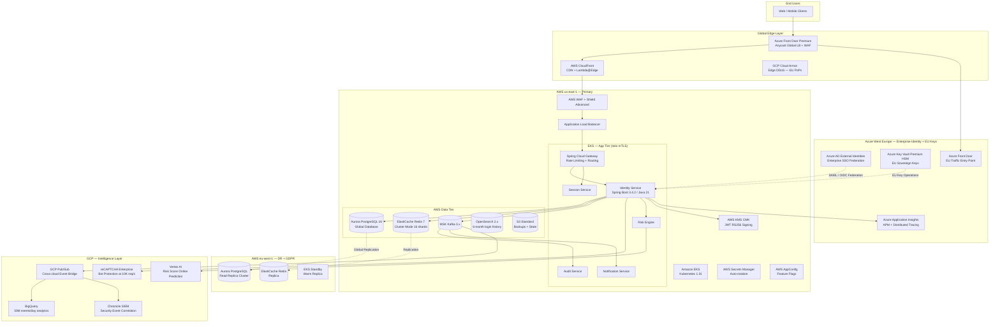
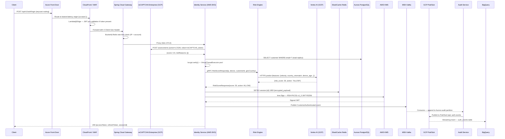
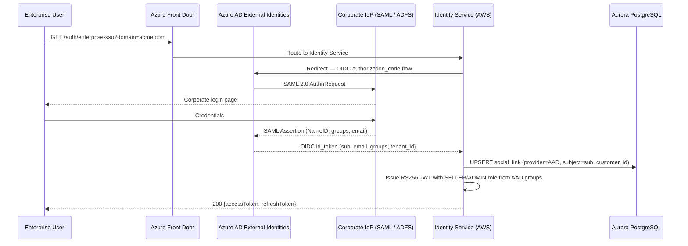
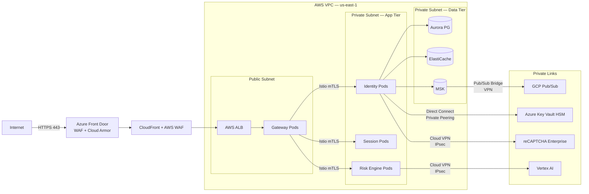

# Hybrid Cloud Architecture Design — E-Commerce Platform
## Customer Identity & Access Management (CIAM)

*Version: 1.0 | February 2026 | Status: Draft*
*Author: Cloud Architecture Practice*
*Based on: `docs/architecture-design.md` v1.1 (FR/NFR source of truth — unchanged)*

---

## 1. Purpose and Scope

This document designs a **hybrid multi-cloud architecture** for the CIAM platform described in `architecture-design.md`. All functional requirements (FR-REG-*, FR-AUTH-*, FR-MFA-*, FR-SESS-*, FR-SEC-*, FR-PWD-*, FR-SOCIAL-*, FR-AUD-*, FR-REC-*, FR-DEV-*) and non-functional requirements remain unchanged. The application runtime is **Spring Boot 3.4.2 + Java 21 Virtual Threads**.

The primary change from the baseline design is the deliberate use of **three cloud providers** — AWS, Azure, and Google Cloud — each assigned the services where it holds a genuine, measurable advantage.

---

## 2. Binding NFR Constraints (from FRD v1.0)

All cloud service selections must satisfy these constraints. Any service that cannot meet a constraint is disqualified regardless of other qualities.

| NFR | Binding Value | Enforcement Point |
|---|---|---|
| Availability SLA | **99.99%** (~52 min/year) | Each critical path component must exceed this individually |
| Concurrent logins | **10,000 req/sec** | Identity Service pod fleet + Aurora read replicas |
| Registered customers | **100 million** | Aurora storage + OpenSearch index capacity |
| Daily active users | **10 million** | ElastiCache session capacity + Redis cluster sharding |
| Concurrent sessions | **5 million** | Redis Cluster: 16 shards, each capable of 500K keys |
| Login events/day | **50 million** | MSK Kafka throughput + BigQuery ingestion pipeline |
| Token validation latency | **< 50ms p99** | JWKS cached at API Gateway; RS256 is µs-level CPU |
| Session lookup latency | **< 10ms p99** | Redis O(1) GET; ElastiCache < 1ms network RTT within AZ |
| RTO | **< 15 minutes** | Aurora automated failover + EKS pod rescheduling |
| RPO | **< 1 minute** | Aurora Global Database synchronous replication (< 1 sec lag) |
| Encryption at rest | **AES-256** | Aurora KMS, ElastiCache, S3, Kafka broker encryption |
| Encryption in transit | **TLS 1.2+ minimum** | ALB policy, Istio mTLS, ElastiCache TLS, MSK TLS |
| Compliance | **GDPR, CCPA, CAN-SPAM, TCPA, CASL** | Azure EU Sovereign Keys, S3 data residency tagging, DPA controls |

---

## 3. Hybrid Cloud Strategy

### 3.1 Why Three Clouds — Not One

| Reason | Detail |
|---|---|
| **Best-of-breed specialisation** | No single cloud leads in every category. Forced to one cloud, you accept second-best in Bot Protection, ML Risk Scoring, and Enterprise Identity |
| **Regulatory compliance** | Azure has the broadest EU data sovereignty commitments. GDPR-sensitive EU personal data benefits from Azure Key Vault HSM with contractual EU-only key processing |
| **No vendor lock-in on identity** | Azure AD External Identities federates enterprise SSO from any IdP without AWS or GCP vendor coupling |
| **Google's native ML pipeline** | reCAPTCHA Enterprise and Vertex AI are Google's own products — uniquely superior to third-party equivalents running on competitor clouds |
| **Cost arbitrage** | BigQuery ML is significantly cheaper than equivalent SageMaker workloads for analytics-heavy fraud modelling at 50M events/day |
| **Resilience via independence** | A cloud-provider-level outage (rare but real) affects only the services assigned to that cloud — not the entire platform |

### 3.2 Cloud Assignment Matrix

Each service is assigned to exactly one provider based on a clear justification. Tie-breaks favour AWS (primary) to minimise network hops for core auth flows.

| Concern | Provider | Service | Why This Provider |
|---|---|---|---|
| Container Orchestration | **AWS** | Amazon EKS (Kubernetes 1.31) | Largest K8s ecosystem; Karpenter for efficient autoscaling; deepest integration with IAM Roles for Service Accounts (IRSA) |
| Primary Database | **AWS** | Aurora PostgreSQL 16 (Global DB) | Only managed PostgreSQL with < 1 sec cross-region replication; meets RPO < 1 min with automated failover |
| Session / Cache | **AWS** | ElastiCache Redis 7 (Cluster Mode) | Sub-millisecond latency within AWS AZ; < 10ms p99 guarantee; 16-shard cluster for 5M concurrent sessions |
| Event Streaming | **AWS** | MSK Managed Kafka 3.x | Best managed Kafka; scales to 50M events/day; tight IAM + TLS integration; partition autoscaling |
| US Key Management | **AWS** | AWS KMS (CMK) | RS256 JWT private key never leaves KMS; `kms:Sign` API; FIPS 140-2 Level 2 |
| US Secret Storage | **AWS** | AWS Secrets Manager | Auto-rotation for DB credentials, Redis tokens, API keys; Spring Cloud AWS Secrets integration |
| CDN / Edge Delivery | **AWS** | Amazon CloudFront | 500+ PoPs; Lambda@Edge for JWT pre-validation; native WAF integration |
| DDoS + WAF (US/APAC) | **AWS** | AWS WAF + Shield Advanced | Layer 3/4/7; OWASP managed rules; real-time metrics; Shield Response Team |
| Login History Query | **AWS** | Amazon OpenSearch 2.x | Full-text + date-range on 6-month window; 50M events/day ingestion via Kafka consumer |
| Object Storage + Backups | **AWS** | Amazon S3 Standard | Aurora automated backups; Terraform state; artifact repository |
| Container Registry | **AWS** | Amazon ECR | Native EKS pull; immutable tags; image scanning via Inspector |
| Feature Flags / Config | **AWS** | AWS AppConfig | Runtime flag updates without redeployment; per-env config; Spring Cloud AWS Config integration |
| Enterprise Identity Federation | **Azure** | Azure AD External Identities | Best-in-class enterprise SSO; SAML 2.0 + OIDC IdP; B2B/B2C; seamless Microsoft 365 federation |
| EU Sovereign Key Management | **Azure** | Azure Key Vault Premium (HSM) | Contractual EU-only key processing; FIPS 140-2 Level 3; satisfies GDPR key residency requirements |
| Global Anycast Load Balancing | **Azure** | Azure Front Door Premium | Anycast routing selects lowest-latency cloud PoP; cross-cloud health checks; WAF at 200+ PoPs |
| Observability APM | **Azure** | Azure Monitor + Application Insights | Best Spring Boot Java APM with distributed trace correlation; smart anomaly detection; zero instrumentation overhead via agent |
| Bot Protection | **GCP** | reCAPTCHA Enterprise | Google's own product; adaptive ML scoring; invisible CAPTCHA at 10K req/s; no third-party dependency |
| ML Risk Engine Backend | **GCP** | Vertex AI (online prediction) | Managed ML serving; auto-scales to 10K predictions/sec; model registry + A/B rollout |
| Auth Event Analytics | **GCP** | BigQuery | < $5/TB query on 50M events/day; no cluster sizing; instant schema evolution; fraud pattern SQL |
| Security Event Management | **GCP** | Google Chronicle SIEM | Petabyte-scale security telemetry; built-in threat intelligence; fastest ingestion at zero-cost ingest model |
| Event Bridge (cross-cloud) | **GCP** | GCP Pub/Sub | Reliable cross-cloud delivery of auth events to BigQuery and Chronicle; global PoP; push to BigQuery directly |
| Edge DDoS (EU) | **GCP** | Cloud Armor | Google's BGP anycast absorbs DDoS at network edge; complementary to AWS Shield for EU traffic |
| Social OAuth — Google | **GCP** | Google Identity Platform | Native Google OIDC; lowest latency for Google Sign-In; no third-party proxy |

### 3.3 Multi-Cloud Connectivity

```
┌─────────────────────────────────────────────┐
│              AWS (us-east-1 + eu-west-1)    │
│  EKS | Aurora | Redis | MSK | KMS | WAF     │
│              │                │             │
│     AWS Transit Gateway       │             │
└──────────────┼────────────────┼─────────────┘
               │                │
    AWS Direct Connect        AWS VGW
    (dedicated 10Gbps)    (IPsec VPN backup)
               │                │
┌──────────────▼──────┐ ┌──────▼──────────────┐
│  Azure (West Europe)│ │  GCP (multi-region) │
│  AD External Id.    │ │  reCAPTCHA Enterprise│
│  Key Vault HSM      │ │  Vertex AI           │
│  Front Door         │ │  BigQuery            │
│  App Insights       │ │  Chronicle SIEM      │
│                     │ │  Pub/Sub             │
│  Azure ExpressRoute │ │  Cloud Armor         │
└─────────────────────┘ └─────────────────────┘
```

**Cross-cloud private links:**
- **AWS → Azure**: AWS Direct Connect → Azure ExpressRoute (10 Gbps dedicated, no public internet)
- **AWS → GCP**: AWS Virtual Private Gateway → GCP Cloud VPN (IPsec, HA pair, 3 Gbps aggregate)
- **GCP Pub/Sub → AWS MSK**: Pub/Sub push subscription to MSK via private VPN tunnel
- All cross-cloud API calls use **private IP addresses** — no public internet traversal

---

## 4. System Architecture

### 4.1 Global Topology



### 4.2 C4 Level 2 — Hybrid Container Diagram

```mermaid
C4Container
    title Container Diagram — Hybrid Cloud CIAM

    Person(customer, "Customer", "Web / Mobile")
    Person(enterprise, "Enterprise User", "SSO via corporate IdP")

    Container(afd, "Azure Front Door Premium", "Anycast CDN + WAF", "Global traffic steering; lowest-latency cloud PoP selection")
    Container(cf, "CloudFront + WAF", "AWS Edge", "US/APAC CDN; Lambda@Edge JWT pre-check")
    Container(gw, "Spring Cloud Gateway", "Spring Boot 3.4.2 / Java 21", "Rate limiting (Bucket4j/Redis), JWT validation, mTLS routing")
    Container(is, "Identity Service", "Spring Boot 3.4.2 / Java 21", "Registration, email/password/social/OTP auth, TOTP MFA, password management")
    Container(ss, "Session Service", "Spring Boot 3.4.2 / Java 21", "Session lifecycle, refresh token rotation, device trust")
    Container(re, "Risk Engine", "Spring Boot 3.4.2 / Java 21", "Risk score aggregation — calls Vertex AI prediction endpoint")
    Container(ns, "Notification Service", "Spring Boot 3.4.2 / Java 21", "Email (SES/SendGrid), SMS (SNS/Twilio), push dispatch")
    Container(au, "Audit Service", "Spring Boot 3.4.2 / Java 21", "Kafka consumer; append-only Aurora write; Pub/Sub forwarding")

    ContainerDb(pg, "Aurora PostgreSQL 16", "AWS — Global Database", "Customer, Device, MFA, SocialLink, PasswordHistory, Consent")
    ContainerDb(redis, "ElastiCache Redis 7", "AWS — Cluster 16 shards", "Sessions, OTPs, rate limit counters, token blacklist")
    ContainerDb(kafka, "MSK Kafka 3.x", "AWS — Managed Kafka", "Domain event bus — 50M events/day")
    ContainerDb(os, "OpenSearch 2.x", "AWS", "6-month login history — full-text + date-range query")

    Container(aad, "Azure AD External Identities", "Azure West Europe", "Enterprise SSO — SAML 2.0 / OIDC federation hub")
    Container(akv, "Azure Key Vault HSM", "Azure West Europe", "EU-sovereign RSA key storage; `wrapKey` / `sign` API for EU users")
    Container(ai, "Application Insights", "Azure", "Distributed traces + JVM metrics; Spring Boot auto-instrumentation")

    Container(recaptcha, "reCAPTCHA Enterprise", "GCP", "Bot score 0.0–1.0 per login/registration action; invisible at 10K req/s")
    Container(vai, "Vertex AI Endpoint", "GCP", "Online ML prediction; risk score model v2; A/B shadow deployment")
    Container(ps, "GCP Pub/Sub", "GCP", "Cross-cloud event bridge — auth events → BigQuery + Chronicle")
    ContainerDb(bq, "BigQuery", "GCP", "50M events/day analytics; fraud pattern queries; model training data")

    Rel(customer, afd, "HTTPS")
    Rel(enterprise, aad, "SAML / OIDC")
    Rel(afd, cf, "Route US/APAC")
    Rel(cf, gw, "HTTPS + mTLS")
    Rel(gw, is, "REST / gRPC — Istio mTLS")
    Rel(gw, ss, "REST — Istio mTLS")
    Rel(is, pg, "JDBC via HikariCP (Virtual Threads)")
    Rel(is, redis, "Lettuce / Spring Data Redis")
    Rel(is, kafka, "Kafka producer — Spring Kafka")
    Rel(is, recaptcha, "HTTPS gRPC — bot score")
    Rel(is, re, "gRPC sync — risk score")
    Rel(re, vai, "HTTPS — online prediction")
    Rel(kafka, au, "Consumer group — audit")
    Rel(kafka, ns, "Consumer group — notification")
    Rel(au, ps, "Pub/Sub publish — cross-cloud bridge")
    Rel(ps, bq, "BigQuery streaming insert")
    Rel(aad, is, "OIDC token — enterprise federation")
    Rel(akv, is, "Key sign API — EU users")
    Rel(is, ai, "OpenTelemetry SDK")
```



### 4.3 Hybrid Login Sequence (Full Flow)



### 4.4 Enterprise SSO Flow (Azure AD External Identities)



---

## 5. Technology Stack

### 5.1 Application — Spring Boot + Java 21

| Concern | Library / Technology | Version | Notes |
|---|---|---|---|
| Framework | Spring Boot | 3.4.2 | Project baseline; auto-configured multi-cloud starters |
| Runtime | Java 21 + Virtual Threads (Project Loom) | 21 LTS | 10K req/s with imperative code; no WebFlux needed |
| Token issuer | Spring Authorization Server | 1.x | Standards-compliant OAuth 2.0 / OIDC; RS256 JWT |
| JWT library | `com.nimbusds:nimbus-jose-jwt` | 9.x | RS256/JWKS; used internally by Spring Authorization Server |
| Spring Security | `spring-boot-starter-security` | managed | Filter chain, RBAC, CSRF, headers |
| Social OAuth | `spring-boot-starter-oauth2-client` | managed | Google OIDC + Facebook OAuth 2.0 + Azure AD OIDC |
| TOTP MFA | `com.warrenstrange:googleauth` | latest | TOTP + backup codes |
| Password hashing | `BCryptPasswordEncoder` (Spring Security) | managed | bcrypt cost 12; `Argon2PasswordEncoder` for future upgrade |
| Password breach | HaveIBeenPwned k-anonymity API | N/A | SHA-1 prefix; no PII sent |
| Rate limiting | `bucket4j-redis` (Bucket4j 8.x) | 8.x | Redis-backed distributed token bucket; Spring Gateway filter |
| ORM | Spring Data JPA + Hibernate 6 | managed | HikariCP; works naturally with virtual threads |
| Resilience | `resilience4j-spring-boot3` | 2.x | Circuit breaker + retry + bulkhead for cross-cloud calls |
| Validation | `spring-boot-starter-validation` | managed | Jakarta Bean Validation 3 |
| Migrations | Flyway | 10.x | Expand-contract migrations; auto-run on startup |
| Observability | Micrometer + Spring Boot Actuator | managed | Multi-cloud exporter: CloudWatch + Azure Monitor + GCP Monitoring |
| API docs | SpringDoc OpenAPI | 2.x | OpenAPI 3 spec auto-generated |
| DTO mapping | MapStruct | 1.6.x | Compile-time type-safe entity ↔ DTO |
| gRPC | `grpc-spring-boot-starter` | 3.x | Risk Engine ↔ Identity Service; Vertex AI client |
| AWS SDK | Spring Cloud AWS 3.x | 3.x | Auto-configured: Secrets Manager, AppConfig, SES, SNS, KMS |
| Azure SDK | `azure-spring-boot-starter` | 5.x | Key Vault, Application Insights, AD B2C integration |
| GCP SDK | `spring-cloud-gcp-starter` | 5.x | Pub/Sub, reCAPTCHA Enterprise, Secret Manager |

### 5.2 Multi-Cloud Secret Injection — Spring Boot Pattern

```java
// Spring Cloud AWS — auto-injects from Secrets Manager
@ConfigurationProperties(prefix = "app.db")
public record DatabaseProperties(String password, String url) {}

// Azure Key Vault — EU-region services use Azure-backed keys
@Bean
public KeyClient euKeyClient(SecretClientBuilder builder) {
    return new KeyClientBuilder()
        .vaultUrl(System.getenv("AZURE_KEY_VAULT_URL"))
        .credential(new DefaultAzureCredentialBuilder().build())
        .buildClient();
}

// Multi-cloud JWT signing — route by user region
@Service
public class JwtSigningService {
    private final KmsClient awsKms;          // US users
    private final KeyClient azureKeyVault;   // EU users (GDPR sovereign)

    public String sign(JWTClaimsSet claims, UserRegion region) {
        return switch (region) {
            case EU -> signWithAzureKeyVault(claims);
            default -> signWithAwsKms(claims);
        };
    }
}
```

### 5.3 Data Layer

| Component | Technology | Provider | Version | Justification |
|---|---|---|---|---|
| Primary database | Aurora PostgreSQL (Global DB) | AWS | PG 16 compat | < 1 sec cross-region replication; meets RPO < 1 min |
| Session / cache | ElastiCache Redis (Cluster Mode) | AWS | Redis 7 | < 10ms session lookup; 5M concurrent sessions |
| Event bus | MSK Managed Kafka | AWS | Kafka 3.x | 50M events/day; durable ordered log; replay |
| Login history | Amazon OpenSearch Service | AWS | OpenSearch 2.x | Full-text + date-range; 6-month queryable window |
| Backups | Amazon S3 Standard | AWS | N/A | Aurora automated backups; Terraform state |
| Auth analytics | BigQuery | GCP | N/A | 50M events/day at < $5/TB; no cluster management |
| SIEM storage | Google Chronicle | GCP | N/A | Petabyte-scale; built-in threat intelligence |

### 5.4 Infrastructure & DevOps

| Concern | Technology | Provider | Justification |
|---|---|---|---|
| Container build | Docker (Dockerfile) | N/A | Standard; portable across all CI/CD |
| Container registry | Amazon ECR | AWS | Native EKS integration; image scanning |
| Orchestration | Amazon EKS (Kubernetes 1.31) | AWS | Managed control plane; Karpenter; IRSA |
| Node autoscaling | Karpenter | AWS | Bin-packing; spot-aware; faster than Cluster Autoscaler |
| API Gateway | Spring Cloud Gateway | App | Native Spring Security; Bucket4j rate limiting |
| Global LB | Azure Front Door Premium | Azure | Anycast; cross-cloud health-based routing |
| Service mesh | Istio | App | mTLS between pods; traffic management; observability |
| IaC | Terraform + Terragrunt | N/A | DRY multi-cloud; module per provider |
| CI/CD | GitHub Actions + ArgoCD | N/A | CI on GitHub; GitOps CD via ArgoCD |
| US secrets | AWS Secrets Manager | AWS | Auto-rotation; Spring Cloud AWS auto-inject |
| EU secrets | Azure Key Vault HSM | Azure | FIPS 140-2 L3; GDPR sovereign; Spring Azure auto-inject |
| US key management | AWS KMS (CMK) | AWS | RS256 signing; FIPS 140-2 L2 |
| EU key management | Azure Key Vault HSM | Azure | GDPR contractual EU-only key operations |
| Feature flags | AWS AppConfig | AWS | Runtime changes; Spring Cloud AWS Config |
| DDoS — US/APAC | AWS WAF + Shield Advanced | AWS | Layer 3/4/7; OWASP managed rules |
| DDoS — EU | GCP Cloud Armor | GCP | BGP anycast absorption; complements AWS Shield |
| Bot protection | reCAPTCHA Enterprise | GCP | Adaptive ML; Google's native product |
| Certificates | AWS ACM + Azure-managed certs | AWS + Azure | Auto-rotation; EKS + Front Door integration |

---

## 6. Security Architecture

### 6.1 Multi-Cloud Zero-Trust Model

```
┌─────────────────────────────────────────────────────────────┐
│                    ZERO TRUST PRINCIPLES                    │
│  1. Never trust, always verify — every request authenticated│
│  2. Least-privilege access — IRSA per microservice         │
│  3. Assume breach — Istio mTLS encrypts all pod traffic    │
│  4. Verify explicitly — device fingerprint + risk score    │
│  5. Cross-cloud calls — private links only, mTLS enforced  │
└─────────────────────────────────────────────────────────────┘
```

### 6.2 Key Management — Region-Aware Routing

| User Region | Key Store | Key Type | Compliance Basis |
|---|---|---|---|
| US | AWS KMS (CMK, us-east-1) | RSA-2048 CMK | FIPS 140-2 Level 2 |
| EU | Azure Key Vault Premium HSM (West Europe) | RSA-2048 HSM | FIPS 140-2 Level 3 + GDPR Art. 25 |
| APAC | AWS KMS (CMK, ap-southeast-1) | RSA-2048 CMK | FIPS 140-2 Level 2 |

**JWT signing flow for EU users:**
```
Identity Service (AWS EKS) → Azure Private Link → Azure Key Vault HSM
  → wrapKey(RSA) → return signed JWT → response to EU client
Private key material never transits public internet or leaves Azure EU region
```

### 6.3 Secrets Management — Multi-Cloud Matrix

| Secret | US Storage | EU Storage | Rotation | Tool |
|---|---|---|---|---|
| JWT signing key | AWS KMS CMK | Azure Key Vault HSM | 90 days automated | KMS / AKV key rotation |
| DB credentials | AWS Secrets Manager | AWS Secrets Manager (eu-west-1) | 30 days | Secrets Manager rotation Lambda |
| Redis auth token | AWS Secrets Manager | AWS Secrets Manager (eu-west-1) | 30 days | Secrets Manager |
| Google OAuth secrets | AWS Secrets Manager | AWS Secrets Manager | Manual | Provider policy |
| Azure AD client secret | AWS Secrets Manager | Azure Key Vault | Manual | Azure AD portal |
| GCP service account key | AWS Secrets Manager | — | 90 days | GCP Workload Identity preferred |
| SMS / Email API keys | AWS Secrets Manager | AWS Secrets Manager | 90 days | Secrets Manager |
| TOTP secrets | Aurora (AES-256 KMS) | Aurora EU (AES-256 AKV) | On MFA reset | App-level envelope enc |
| Backup codes | Aurora (bcrypt) | Aurora EU (bcrypt) | On regeneration | App-level |

### 6.4 Network Segmentation — Multi-Cloud



### 6.5 STRIDE Threat Model — Hybrid Cloud Additions

Beyond the threats in `architecture-design.md`, hybrid cloud introduces additional threat vectors:

| Threat | Category | Mitigation |
|---|---|---|
| Cross-cloud man-in-the-middle on private links | Tampering | IPsec + TLS double encryption on all cross-cloud links; certificate pinning on SDK calls |
| GCP service account key exfiltration | Elevation of Privilege | Use GCP Workload Identity Federation (no long-lived key files); bind to EKS IRSA identity |
| Azure AD token forgery for enterprise SSO | Spoofing | Validate `iss`, `aud`, `tid` claims strictly; verify JWKS from Azure well-known endpoint |
| Supply chain attack on multi-cloud SDKs | Tampering | Pin AWS/Azure/GCP SDK versions in `pom.xml`; OWASP Dependency Check in CI; private Nexus mirror |
| Cross-cloud latency spike degrades auth SLA | Denial of Service | Resilience4j circuit breaker on every cross-cloud call; local fallback (e.g., default MEDIUM risk if Vertex AI unavailable) |
| BigQuery data exfiltration | Information Disclosure | Column-level security on PII fields; VPC Service Controls boundary; all queries logged to Chronicle |
| reCAPTCHA bypass via token farming | Spoofing | Enterprise tier threshold tuning; combine with IP velocity check and device fingerprint; not sole defence |

### 6.6 Encryption Strategy

| Data | In Transit | At Rest | Key Owner |
|---|---|---|---|
| All API traffic | TLS 1.3 (min 1.2) | N/A | ACM / Azure certs |
| DB connections | TLS (Aurora enforced) | AES-256 (Aurora + KMS) | AWS KMS (US) / Azure AKV (EU) |
| PII fields (email, phone) | TLS | AES-256-GCM (KMS DEK) | AWS KMS / Azure AKV by region |
| TOTP MFA secrets | TLS | AES-256 envelope enc | KMS (US) / AKV (EU) |
| Redis session data | TLS (ElastiCache) | AES-256 (ElastiCache) | AWS KMS |
| Kafka messages (PII) | TLS + MSK broker enc | Kafka at-rest enc | AWS KMS |
| BigQuery auth events | TLS (GCP internal) | AES-256 (GCP-managed) | GCP CMEK (optional) |
| Cross-cloud links | IPsec + TLS | N/A | AWS/Azure/GCP managed |

---

## 7. Observability — Multi-Cloud Unified View

### 7.1 Telemetry Pipeline

```
Spring Boot Services (OpenTelemetry SDK)
    │
    ├── Metrics ──────► Micrometer ──────► AWS CloudWatch (primary)
    │                                   └► Azure Monitor (APM alerts)
    │
    ├── Traces ────────► OTLP Exporter ──► Azure Application Insights
    │                                   └► AWS X-Ray (AWS services)
    │
    └── Logs ──────────► Logback JSON ───► Fluent Bit (DaemonSet)
                                        ├► Amazon CloudWatch Logs
                                        ├► Azure Log Analytics
                                        └► Google Chronicle (SIEM)
```

### 7.2 Observability Stack

| Concern | Technology | Provider | Notes |
|---|---|---|---|
| Metrics collection | Micrometer + Prometheus | AWS (EKS) | Auto-instruments Spring MVC, HikariCP, Redis, Kafka |
| Metrics storage | AWS CloudWatch | AWS | 15-month retention; SLO dashboards |
| APM / Distributed traces | Azure Application Insights | Azure | Best-in-class Java APM; auto-correlation across services |
| Error tracking | Azure App Insights Smart Detection | Azure | Anomaly detection on failure rate, latency spikes |
| Log aggregation | Amazon CloudWatch Logs | AWS | Fluent Bit → CloudWatch structured JSON |
| Security events | Google Chronicle SIEM | GCP | Auth events from Pub/Sub; threat correlation; 1-year retention |
| Dashboards | Grafana (on EKS) | App | Cross-cloud data sources: CloudWatch + Azure Monitor + GCP Monitoring |
| Alerting | Grafana Alerts + PagerDuty | App | SLO burn rate alerts; cross-cloud unified alert routing |
| SLO tracking | Grafana SLO plugin | App | 99.99% auth availability tracked as error budget |
| Synthetic monitoring | CloudWatch Synthetics | AWS | Login flow canary every 60s; token refresh canary |

### 7.3 Key Dashboards

| Dashboard | Metrics | Alert Threshold |
|---|---|---|
| Auth SLO | 5xx error rate, p99 login latency | Error budget burn rate > 2× |
| Cross-cloud latency | Vertex AI p99, reCAPTCHA p99, AKV sign p99 | Any cross-cloud call > 200ms p99 |
| Risk Engine | ML model prediction latency, circuit-breaker state | Model p99 > 100ms or CB open |
| Session health | Redis hit rate, session creation rate, eviction rate | Hit rate < 95% or evictions spike |
| Enterprise SSO | AAD federation success rate, token validation errors | AAD error rate > 1% |
| Security | Login failure rate, lockout rate, IP anomaly score | Failure spike > 3× baseline |

---

## 8. Data Architecture

### 8.1 Data Store Summary

| Store | Technology | Provider | Data | Retention |
|---|---|---|---|---|
| Customer records | Aurora PostgreSQL 16 (Global DB) | AWS | Customer, Device, MFA, SocialLink, PasswordHistory | Account lifetime |
| EU customer data | Aurora PostgreSQL (eu-west-1 cluster) | AWS | Same schema — GDPR data residency | Account lifetime |
| Session store | ElastiCache Redis 7 (Cluster) | AWS | Active sessions, refresh tokens, OTPs, blacklist | Per TTL |
| Rate limit counters | ElastiCache Redis 7 | AWS | Per-IP, per-account, per-phone | Sliding window |
| Audit log (hot) | Aurora PostgreSQL (monthly partitions) | AWS | All auth events | **6 months — partition drop** |
| Login history (queryable) | Amazon OpenSearch 2.x | AWS | Auth events customer-facing history | **6 months** |
| Consent records | Aurora PostgreSQL | AWS | Terms acceptance, marketing consent | Indefinite (legal) |
| Auth event analytics | BigQuery (dataset: auth_events) | GCP | Anonymised 50M events/day; fraud analysis | 2 years (analytics) |
| Security events | Google Chronicle | GCP | Full security telemetry | 1 year |

### 8.2 BigQuery Schema (Analytics — no PII)

```sql
-- anonymised auth event — no direct PII stored in BigQuery
CREATE TABLE auth_events.login_events (
    event_id        STRING,
    event_time      TIMESTAMP,
    event_type      STRING,        -- AUTHENTICATED, FAILED, LOCKED
    customer_hash   STRING,        -- SHA-256(customer_id) — not reversible
    country_code    STRING,
    risk_score      INT64,
    auth_method     STRING,        -- PASSWORD, GOOGLE, TOTP
    mfa_used        BOOL,
    device_type     STRING,
    outcome         STRING         -- SUCCESS, FAILURE, MFA_REQUIRED
)
PARTITION BY DATE(event_time)
CLUSTER BY country_code, event_type;
```

### 8.3 Data Residency Rules (GDPR)

| Data Type | EU Residency Rule | Implementation |
|---|---|---|
| EU customer PII (email, phone, name) | Must remain in EU | Aurora eu-west-1 cluster; no replication to us-east-1 |
| EU session tokens | Processed in EU | ElastiCache eu-west-1 replica serves EU users |
| EU JWT signing | Keys in EU | Azure Key Vault HSM (West Europe) — keys never leave EU |
| Analytics (BigQuery) | Anonymised before export | SHA-256 customer hash; no reversible PII in BigQuery |
| Security events (Chronicle) | Anonymised | Same as BigQuery — customer_hash only |

---

## 9. CI/CD and DevOps

### 9.1 Multi-Cloud Infrastructure as Code

```
terraform/
├── providers/
│   ├── aws.tf                    # AWS provider + IRSA
│   ├── azure.tf                  # Azure provider + Service Principal
│   └── gcp.tf                    # GCP provider + Workload Identity
├── modules/
│   ├── aws/
│   │   ├── eks-cluster/          # EKS 1.31, Karpenter, IRSA
│   │   ├── aurora-global/        # PostgreSQL 16, Global DB, 2 regions
│   │   ├── elasticache-redis/    # Cluster Mode, 16 shards, Multi-AZ
│   │   ├── msk-kafka/            # MSK, TLS, IAM auth
│   │   ├── cloudfront-waf/       # CloudFront + WAF + Shield Advanced
│   │   ├── kms/                  # CMK for JWT, Aurora, Redis, S3
│   │   └── secrets-manager/      # Secret definitions + rotation
│   ├── azure/
│   │   ├── front-door/           # Front Door Premium + WAF policy
│   │   ├── key-vault-hsm/        # Premium HSM, RBAC, EU region
│   │   ├── aad-external-id/      # B2C tenant, SAML/OIDC IdPs
│   │   └── application-insights/ # Workspace, smart detection
│   └── gcp/
│       ├── recaptcha-enterprise/ # Site key, API enable
│       ├── vertex-ai/            # Endpoint, model registry
│       ├── bigquery/             # Dataset, table, IAM, VPC SC
│       ├── pubsub/               # Topics, subscriptions, IAM
│       └── chronicle/            # Feed config, RBAC
├── environments/
│   ├── dev/
│   ├── staging/
│   ├── prod-us/
│   └── prod-eu/
└── global/
    ├── network/                  # Direct Connect, Cloud VPN, peering
    └── iam-roles/                # Least-privilege cross-cloud roles
```

### 9.2 CI/CD Pipeline

```mermaid
flowchart LR
    A[Git Push] --> B[GitHub Actions\nmvn verify\nArchUnit checks]
    B --> C{Pass?}
    C -->|Yes| D[SAST: SonarQube\nOWASP Dep Check\nSpotBugs]
    D --> E[Docker Build\nmulti-arch image\nECR Push]
    E --> F[Trivy image scan]
    F --> G[Terraform plan\nall 3 clouds]
    G --> H{Plan approved?}
    H -->|Yes| I[ArgoCD → Dev\nterraform apply dev]
    I --> J[Integration Tests\nTestcontainers\nGatling 1K req/s]
    J --> K[PR Review]
    K -->|Merge main| L[ArgoCD → Staging\nterraform apply staging]
    L --> M[Gatling 10K req/s\nperformance gate]
    L --> N[DAST: OWASP ZAP]
    M & N -->|Pass| O[Manual approval\nall 3 cloud ops]
    O --> P[Canary 5% → Prod\nBlue/Green ArgoCD]
    P --> Q{Error rate < 0.1%?}
    Q -->|Yes| R[Progressive rollout\n25%→50%→100%]
    Q -->|No| S[Auto rollback\nArgoCD sync]
```



### 9.3 GCP Workload Identity — No Service Account Keys

```yaml
# EKS pod annotation — federated identity to GCP (no key files)
apiVersion: v1
kind: ServiceAccount
metadata:
  name: identity-service
  annotations:
    eks.amazonaws.com/role-arn: arn:aws:iam::ACCOUNT:role/identity-service
    iam.gke.io/gcp-service-account: identity-svc@PROJECT.iam.gserviceaccount.com
```

---

## 10. Scalability and Resilience

### 10.1 Cross-Cloud Resilience Matrix

| Component | Primary | Fallback | Circuit Breaker Config |
|---|---|---|---|
| Vertex AI risk scoring | GCP Vertex AI | Default MEDIUM risk (allow + MFA) | 5 failures / 10s → open; 30s half-open |
| reCAPTCHA Enterprise | GCP | Fail open (log warning; enhanced velocity check) | 3 failures / 5s → open |
| Azure Key Vault (EU) | Azure AKV HSM | AWS KMS (temporary EU fallback, documented exception) | 3 failures / 5s → open |
| Azure AD External Identities | Azure AADEI | Disable enterprise SSO; email/password remains | 5 failures / 10s → open |
| GCP Pub/Sub (event bridge) | Pub/Sub | MSK direct → audit; BigQuery sync delayed | 5 failures / 10s → open |
| Aurora PostgreSQL | us-east-1 primary | eu-west-1 replica (promote on failover) | N/A — Aurora managed |
| ElastiCache Redis | Primary cluster | Stateless JWT-only mode (no new sessions) | Custom fallback |
| MSK Kafka | us-east-1 | SQS as emergency fallback for audit events | Retry with backoff |

### 10.2 Resilience4j Configuration — Spring Boot

```java
@Configuration
public class ResilienceConfig {

    @Bean
    public CircuitBreakerConfig vertexAiCbConfig() {
        return CircuitBreakerConfig.custom()
            .failureRateThreshold(50)
            .slowCallRateThreshold(80)
            .slowCallDurationThreshold(Duration.ofMillis(500))
            .waitDurationInOpenState(Duration.ofSeconds(30))
            .permittedNumberOfCallsInHalfOpenState(3)
            .build();
    }

    @Bean
    public CircuitBreakerConfig azureKeyVaultCbConfig() {
        return CircuitBreakerConfig.custom()
            .failureRateThreshold(30)       // Stricter — signing failures are critical
            .waitDurationInOpenState(Duration.ofSeconds(10))
            .recordExceptions(AzureException.class, TimeoutException.class)
            .build();
    }
}
```

### 10.3 Scaling Strategy

| Component | Strategy | Trigger | Target |
|---|---|---|---|
| Identity Service | HPA + Karpenter | CPU > 60% or > 2K RPS/pod | 20 pods × 500 RPS = 10K/s |
| Session Service | HPA | Memory > 70% or > 5K RPS/pod | 10 pods |
| Risk Engine | HPA | CPU > 70% | 5 pods |
| Vertex AI Endpoint | Auto-scaling (managed) | Request queue depth | GCP-managed |
| reCAPTCHA Enterprise | Serverless | N/A | GCP-managed |
| Aurora PostgreSQL | 3 read replicas + Auto Scaling | Replica lag | Aurora-managed |
| Redis Cluster | 16 shards, 3 nodes each | Memory > 70% | ElastiCache-managed |
| MSK Kafka | Partition scaling | Consumer lag | MSK-managed |

### 10.4 Multi-Region DR

| Event | Detection | Recovery Action | Target |
|---|---|---|---|
| AWS us-east-1 partial degradation | CloudWatch SLO burn rate | Shift traffic via Azure Front Door health routing | < 2 min |
| Aurora primary failure | Aurora failover event | Automatic promote eu-west-1 reader cluster | RTO < 5 min, RPO < 1 min |
| Redis cluster failure | CloudWatch: cache errors | Circuit breaker → stateless JWT-only mode | < 30 sec detection |
| Full us-east-1 outage | AFD health check failure | Route 100% to eu-west-1 warm EKS standby | RTO < 15 min |
| GCP zonal outage | GCP uptime alerts | Vertex AI endpoint is multi-region; failover automatic | < 1 min |
| Azure region outage | Front Door health check | Route EU traffic direct to AWS eu-west-1 | < 2 min |

---

## 11. Cost Optimisation

### 11.1 Multi-Cloud Cost Model (Estimated — 10M DAU)

| Component | Provider | Estimated Monthly Cost | Optimisation |
|---|---|---|---|
| EKS compute (20 pods spot mix) | AWS | $3,500 | Karpenter spot + on-demand mix (70/30) |
| Aurora Global DB | AWS | $2,800 | Auto Pause dev clusters; serverless v2 for staging |
| ElastiCache Redis (16 shards) | AWS | $2,200 | Reserved instances (1-year) |
| MSK Kafka | AWS | $1,800 | Tiered storage for historical partitions |
| CloudFront + WAF + Shield | AWS | $1,500 | Reserved capacity; Shield Advanced flat fee |
| Azure Front Door Premium | Azure | $800 | Included WAF; shared across services |
| Azure Key Vault HSM | Azure | $400 | Per-operation pricing; HSM Premium |
| Azure Application Insights | Azure | $600 | Sampling at 10% for high-volume traces |
| Azure AD External Identities | Azure | $300 | MAU-based pricing; enterprise users only |
| reCAPTCHA Enterprise | GCP | $500 | First 1M assessments/month free |
| Vertex AI (online prediction) | GCP | $700 | Pre-provisioned replicas; auto-scale to zero off-hours |
| BigQuery | GCP | $200 | Partitioned + clustered tables; slots reservation |
| Chronicle SIEM | GCP | $1,200 | Flat-rate ingest; no per-GB charge |
| GCP Pub/Sub | GCP | $150 | Per-message pricing; tiny at event volume |
| **Total (estimated)** | | **~$16,450/month** | ~$197K/year — competitive with equivalent single-cloud |

### 11.2 Cost Governance

- **AWS Savings Plans**: 3-year compute savings plan for EKS baseline workload (~35% saving)
- **Spot Instances**: Karpenter manages spot interruption; stateless pods re-schedule in < 2 min
- **BigQuery**: Partitioned tables reduce scan cost to relevant days only; clustering by `country_code, event_type` for fraud queries
- **Chronicle**: Zero-cost ingest model — pay for compute queries, not storage ingestion
- **reCAPTCHA**: Enterprise tier billed per assessment above free tier; 1M/month free covers dev + staging

---

## 12. Implementation Roadmap

### Phase 1 — AWS Foundation + Identity Core (Months 1–3)

| Weeks | Deliverable | Cloud |
|---|---|---|
| 1–2 | Terraform: EKS, Aurora Global, ElastiCache, MSK, KMS, Secrets Manager | AWS |
| 2–3 | Azure Terraform: Front Door, Key Vault HSM, Application Insights | Azure |
| 3–4 | GCP Terraform: reCAPTCHA Enterprise, Pub/Sub, BigQuery dataset | GCP |
| 3–4 | Multi-cloud network: Direct Connect (AWS→Azure), Cloud VPN (AWS→GCP) | All |
| 5–6 | Identity Service: customer registration, email/password auth, bcrypt + JWT RS256 | App |
| 7–8 | Session management: Redis sessions, refresh token rotation | App |
| 9–10 | Rate limiting (Bucket4j/Redis), account lockout | App |
| 11–12 | Audit Service: Kafka → Aurora partitions + Pub/Sub → BigQuery pipeline | App |

**Spike (week 2):** Validate bcrypt cost-12 throughput + cross-cloud latency budget. Vertex AI p99 must be < 100ms within AWS→GCP latency. Establish baseline before locking pod specs.

### Phase 2 — Extended Auth + Enterprise SSO (Months 4–6)

| Weeks | Deliverable | Cloud |
|---|---|---|
| 13–15 | Phone OTP, TOTP MFA, backup codes | App |
| 16–17 | Google OIDC + Facebook OAuth 2.0 social auth | App + GCP |
| 18–20 | Azure AD External Identities federation — enterprise SAML / OIDC SSO | Azure + App |
| 21–22 | Social account linking; password reset; account recovery | App |
| 23–24 | EU key routing — Azure Key Vault HSM for EU user JWT signing | Azure + App |

### Phase 3 — Intelligence + Compliance (Months 7–9)

| Weeks | Deliverable | Cloud |
|---|---|---|
| 25–27 | Vertex AI risk model v1 training (BigQuery data); deploy online endpoint | GCP |
| 28–29 | Risk Engine: integrate Vertex AI prediction; replace heuristic scorer | App + GCP |
| 30–31 | Chronicle SIEM: ingest auth events; build threat detection rules | GCP |
| 32–33 | GDPR compliance: data export, account deletion, consent audit trail | App |
| 34–36 | Device management, multi-device sessions, security notifications | App |
| 34–36 | Load test: 10K logins/sec end-to-end; multi-region DR drill | All |

### Phase 4 — Commerce Platform + Full Hardening (Months 10–12)

| Deliverable | Cloud |
|---|---|
| Product Catalog, Order, Payment, Seller services | AWS |
| API Gateway hardening; full cross-cloud observability dashboards | All |
| Vertex AI risk model v2 (trained on 6 months of real data) | GCP |
| SOC 2 Type II evidence collection; GDPR DPA review | All |
| Multi-region failover drill: validate RTO < 15 min + RPO < 1 min end-to-end | AWS |

---

## 13. Architecture Decision Records (ADRs)

### ADR-H-001: Azure Key Vault HSM for EU JWT Signing over AWS KMS

- **Context:** GDPR Article 25 (Data Protection by Design) and EU data sovereignty requirements demand that cryptographic key operations on EU user data are performed within the EU under contractual EU-processing guarantees
- **Decision:** EU users' JWT tokens are signed using Azure Key Vault Premium HSM (West Europe). AWS KMS does not offer contractual guarantees that EU CMK operations stay within the EU — it offers region isolation but not sovereignty contracts. Azure Key Vault HSM provides FIPS 140-2 Level 3 + contractual EU-only processing
- **Alternatives:** AWS KMS eu-west-1 (FIPS 140-2 L2; no sovereign contract); AWS CloudHSM (L3; no Azure-level DPA); HashiCorp Vault EU (operational overhead)
- **Trade-offs:** Cross-cloud private link latency for EU key signing (< 10ms on Direct Connect); additional operational complexity of dual key management systems
- **Consequence:** Region detection middleware in Identity Service routes signing to AWS KMS (US) or Azure AKV HSM (EU). Fallback: if AKV unavailable, circuit breaker opens; emit alert; temporary fallback to AWS KMS eu-west-1 documented as GDPR exception in incident log

### ADR-H-002: GCP reCAPTCHA Enterprise over AWS WAF Bot Control or Third-Party Providers

- **Context:** Bot protection is needed at 10K req/s with < 5ms overhead per request. Login and registration endpoints are primary targets
- **Decision:** GCP reCAPTCHA Enterprise. It is Google's own product — the same technology that protects Google accounts. Adaptive ML scoring, invisible v3 mode, 1M free assessments/month. AWS WAF Bot Control uses third-party signals; third-party providers (e.g., Cloudflare Turnstile) add another vendor dependency
- **Alternatives:** AWS WAF Bot Control (integrated but less sophisticated ML); Cloudflare Turnstile (no cloud lock-in but lowest signal richness); Arkose Labs (premium cost)
- **Trade-offs:** Cross-cloud API call adds ~5ms from AWS EKS to GCP. Mitigated by: async pre-fetch, circuit breaker fail-open, and reCAPTCHA Enterprise SLA of 99.99%
- **Consequence:** reCAPTCHA score is one input to the risk decision — not the sole gate. Score < 0.3 → require MFA; < 0.1 → block. Circuit breaker fail-open means a GCP outage degrades to velocity-only protection (acceptable)

### ADR-H-003: Vertex AI over SageMaker for Risk Engine ML

- **Context:** Risk Engine requires an ML model for login anomaly scoring. The model must serve predictions at < 100ms p99 at 10K req/s scale
- **Decision:** Google Vertex AI Online Prediction endpoint. Advantages: managed model registry with A/B traffic split, auto-scaling to zero off-hours (cost saving), native BigQuery integration for training data (50M events/day already in BigQuery), pre-built monitoring for training/serving skew
- **Alternatives:** AWS SageMaker Real-time Inference (tightly integrated with AWS but ~2× cost for same throughput; no native BigQuery training); in-process rule engine (no ML capability; brittle)
- **Trade-offs:** Cross-cloud latency AWS→GCP (~20ms on Cloud VPN; < 5ms on Interconnect). All auth flows tolerate additional 20ms given the 50ms token validation NFR is for JWT validation only, not total login latency. Risk scoring is parallel to session creation
- **Consequence:** Resilience4j circuit breaker on Vertex AI call. Fallback: return default MEDIUM risk score → require MFA. Model training runs as BigQuery ML job weekly; promoted to endpoint via CI/CD with canary split

### ADR-H-004: Azure AD External Identities over AWS Cognito for Enterprise Federation

- **Context:** Enterprise customers (B2B sellers) use corporate SAML 2.0 IdPs (ADFS, Okta, PingFederate). A federation hub is required
- **Decision:** Azure AD External Identities (formerly Azure AD B2C). It is the market leader for enterprise identity federation, natively understanding SAML 2.0, WS-Fed, OIDC, and Microsoft 365 tenants. Configuration is GUI + policy-based; no code changes for new IdP onboarding
- **Alternatives:** AWS Cognito (SAML support is limited; poor enterprise management UI; no built-in Microsoft tenant federation); Auth0 (excellent but adds third-party cost and dependency); custom SAML SP in Spring Boot (maximum control, massive implementation cost)
- **Trade-offs:** Azure dependency in the auth critical path; mitigated by circuit breaker (enterprise SSO failure → email/password still works); additional cost (MAU-based)
- **Consequence:** Azure AD External Identities issues an OIDC token; Identity Service validates it and maps to internal CustomerId. The `SocialAuthProvider` interface cleanly wraps AAD alongside Google and Facebook providers

### ADR-H-005: GCP BigQuery over AWS OpenSearch or Redshift for Auth Analytics

- **Context:** 50M auth events/day need to be queryable for fraud pattern analysis, ML model training, and compliance reporting
- **Decision:** Google BigQuery. Serverless; no cluster sizing required; partitioned + clustered tables make fraud queries cheap; native BigQuery ML for model training; Chronicle directly integrates for SIEM correlation. Cost at 50M events/day with 2-year retention: ~$200/month vs ~$2,500/month for equivalent Redshift cluster
- **Alternatives:** AWS OpenSearch (already used for 6-month login history — kept for customer-facing queries); AWS Redshift (higher cost; cluster management); AWS Athena on S3 (viable but separate pipeline)
- **Trade-offs:** Data crosses cloud boundary (Kafka → Pub/Sub → BigQuery); latency is acceptable as this is the analytics pipeline, not the auth hot path. PII is anonymised (customer_hash) before export
- **Consequence:** OpenSearch is retained for the customer-facing "login history" feature (6-month, real-time queryable). BigQuery is the analytics store (fraud, ML training, compliance). The two stores have different SLAs and latency requirements

---

## 14. Risk Register

| ID | Risk | Likelihood | Impact | Mitigation |
|---|---|---|---|---|
| R-H-001 | **Cross-cloud latency spike violates auth SLA** — Vertex AI or AKV call adds > 50ms unexpectedly | Low | High | Resilience4j CB + fallback on every cross-cloud call; latency budget tested in week-2 spike; private links (not public internet) give consistent latency |
| R-H-002 | **Multi-cloud operational complexity** — three cloud consoles, three billing accounts, three IAM models | High | Medium | Terraform multi-cloud IaC as single source of truth; Grafana unified dashboard; single on-call runbook per service regardless of underlying cloud |
| R-H-003 | **Azure Key Vault HSM unavailability causes EU login failure** | Low | Critical | CB opens → temporary fallback to AWS KMS eu-west-1; logged as GDPR exception; incident report within 24h; DR tested quarterly |
| R-H-004 | **GCP reCAPTCHA Enterprise outage degrades bot protection** | Low | Medium | CB opens → fail-open; enhanced IP velocity check as compensating control; reCAPTCHA is not sole bot defence |
| R-H-005 | **Azure AD External Identities misconfiguration allows SAML assertion injection** | Low | Critical | Strict claim validation (`iss`, `aud`, `tid`); signed assertions required; SAML XML signature verification; pentest before go-live |
| R-H-006 | **BigQuery PII leak via mis-scoped IAM** | Low | Critical | Column-level security; VPC Service Controls boundary; all queries audited to Chronicle; no direct PII — customer_hash only |
| R-H-007 | **Cross-cloud network (Direct Connect / Cloud VPN) outage** | Low | High | IPsec VPN as backup for Direct Connect; services designed to tolerate cross-cloud latency spikes; CB ensures core auth never blocks on cross-cloud call |
| R-H-008 | **Triple-cloud cost exceeds single-cloud alternative** | Medium | Medium | BigQuery and Chronicle pricing model (serverless / flat-rate) significantly undercuts SageMaker + OpenSearch at scale; quarterly cost review; reserved capacity for AWS baseline |
| R-H-009 | **Vertex AI model drift degrades risk scoring accuracy** | Medium | Medium | BigQuery ML training/serving skew monitoring; model performance dashboard; weekly retrain pipeline; shadow deployment with 5% traffic before promotion |
| R-H-010 | **bcrypt cost-12 throughput bottleneck at 10K logins/sec** (inherited from baseline) | Medium | High | Dedicated VirtualThread executor pool; week-2 throughput spike test; right-size pod count before Phase 1 completion |
